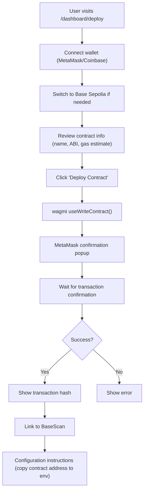
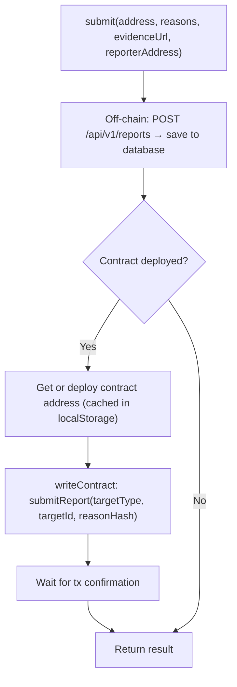

## 1. Blockchain Integration

### 1.1 Viem Clients (`lib/viem.ts`)

Three separate clients:

| Client | Chain | Purpose |
|--------|-------|---------|
| `publicClient` | Base Sepolia | Read blockchain data (getCode, readContract, getBalance) |
| `walletClient` | Base Sepolia | Server-side writes (requires `WALLET_PRIVATE_KEY`) |
| `mainnetClient` | Ethereum Mainnet | ENS resolution only |

**Configuration:**
```typescript
publicClient: createPublicClient({
  chain: baseSepoliaConfig,
  transport: http(rpcUrl, {
    timeout: 30_000,
    retryCount: 3,
  }),
})
```

**Utility Functions:**

| Function | Description |
|----------|-------------|
| `isValidAddress(address)` | Validate 0x address format |
| `getBytecode(address)` | Get contract bytecode (null if EOA) |
| `getBytecodeHash(address)` | Hash for similarity detection |
| `isContract(address)` | Check if address has bytecode |
| `getTransactionReceipt(hash)` | Get tx receipt |
| `detectInputType(input)` | Detect address/ens/domain |
| `resolveEns(name)` | ENS → address |
| `resolveInput(input)` | Universal input resolution |

### 1.2 Wagmi Configuration (`lib/wagmi.ts`)

Client-side wallet integration:

```typescript
createConfig({
  chains: [base, baseSepolia],
  connectors: [
    injected(),                           // MetaMask, etc.
    coinbaseWallet({ appName: 'Doman' }), // Coinbase Wallet
  ],
  transports: {
    [base.id]: http('https://mainnet.base.org'),
    [baseSepolia.id]: http(rpcUrl),
  },
  ssr: true,  // Enable SSR support
})
```

### 1.3 Chain Configuration (`config/chains.ts`)

| Chain | ID | RPC | Explorer |
|-------|----|-----|----------|
| Base Sepolia | 84532 | `https://sepolia.base.org` | `https://sepolia.basescan.org` |
| Base Mainnet | 8453 | `https://mainnet.base.org` | `https://basescan.org` |

The chain is determined by the `NEXT_PUBLIC_BASE_CHAIN_ID` env variable.

---

## 2. Smart Contract Integration

### 2.1 ScamReporter Contract (`config/contracts.ts`)

Contract ABI and address for on-chain scam reporting.

**Contract Functions:**

| Function | Signature | Description |
|----------|-----------|-------------|
| `submitReport` | `(targetType, targetId, reasonHash)` | Submit scam report on-chain |
| `submitVote` | `(targetType, targetId, support)` | Vote on existing report |
| `addressToTargetId` | `(address)` → `targetId` | Get target ID for address |
| `hasVoted` | `(targetId, voter)` → `bool` | Check if already voted |

**Contract Events:**

| Event | Parameters |
|-------|-----------|
| `ScamReportSubmitted` | reporter, targetType, targetId, reasonHash |
| `ScamVoteSubmitted` | voter, targetType, targetId, support |

**Custom Errors:**

| Error | Condition |
|-------|-----------|
| `AlreadyVoted` | Voter already cast vote on this target |
| `EmptyReasonHash` | Reason hash is empty (bytes32(0)) |
| `EmptyTargetId` | Target ID is empty |
| `InvalidTargetType` | Target type not recognized |

**Supported Chains:**

| Chain | Chain ID | Contract Address |
|-------|----------|-----------------|
| Base Mainnet | 8453 | TBD (not deployed yet) |
| Base Sepolia | 84532 | TBD (not deployed yet) |

### 2.2 Deploy Page (`/dashboard/deploy`)

Allows admins to deploy the ScamReporter contract:



### 2.3 Report Hook (`hooks/use-report-scam.ts`)

Custom hook that handles the complete scam reporting workflow:

**States:** `idle` → `saving` → `deploying` → `wallet` → `confirming` → `success` / `error`

**Flow:**



**Input Type Support:**
- `0x address` → targetType = 0
- `ENS name (.eth)` → targetType = 1
- `Domain` → targetType = 2

**Helper Functions:**
- `getCachedAddress(chainId)` — Get contract from localStorage cache
- `getTargetTypeAndId(input)` — Determine target type and compute ID
