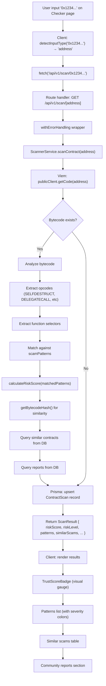
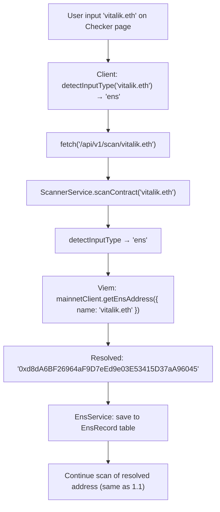
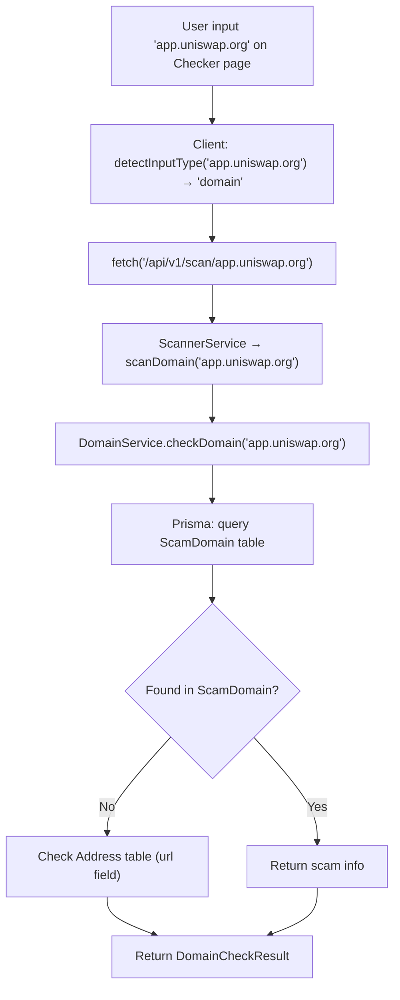
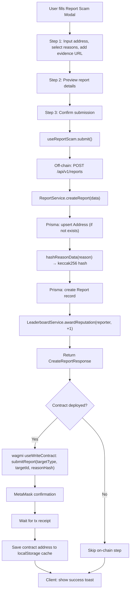
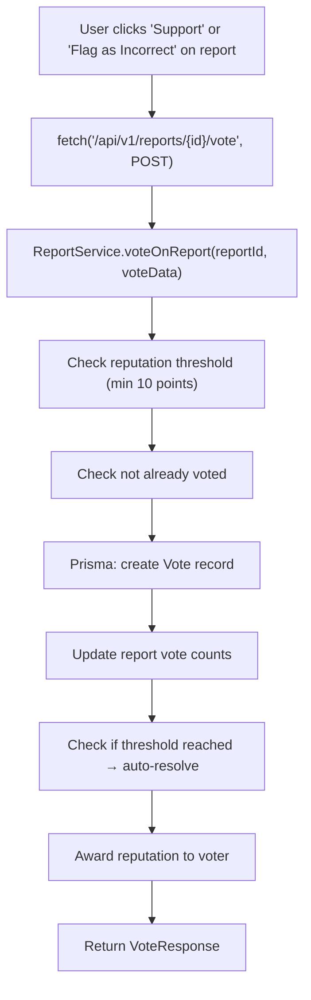
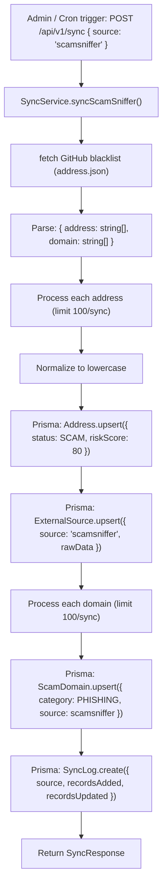
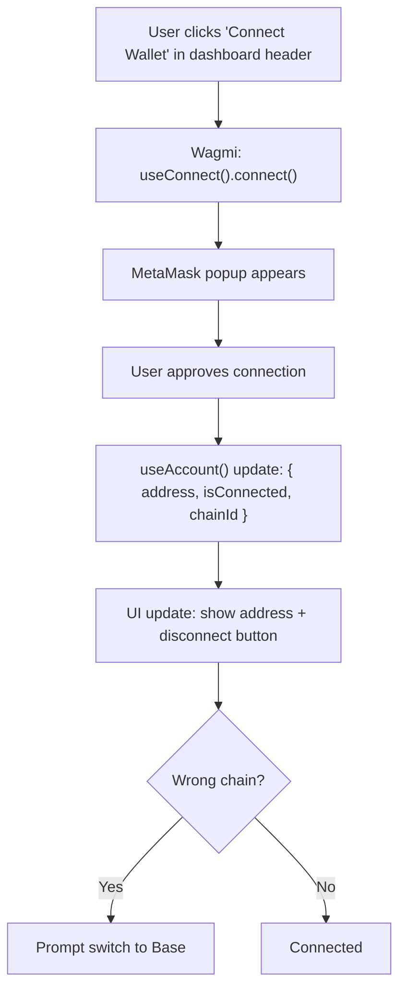

## 1. End-to-End Data Flows

### 1.1 Address Scan



### 1.2 ENS Resolution + Scan



### 1.3 Domain Check



### 1.4 Report Submission (Off-chain + On-chain)



### 1.5 Voting on Report



### 1.6 External Data Sync



### 1.7 Wallet Connection



---

## 2. Testing & Debug

### 2.1 Manual Testing Checklist

#### Landing Page
- [ ] Hero section loads with gradient text
- [ ] CTA buttons navigate to /dashboard
- [ ] Use case cards visible
- [ ] Footer links work

#### Dashboard
- [ ] Stats cards load data from database
- [ ] Recent activity table populated
- [ ] Sidebar navigation works (all links)
- [ ] Search bar functional

#### Checker
- [ ] Input valid 0x address → scan results displayed
- [ ] Input ENS name → resolved + scanned
- [ ] Input domain → domain check result
- [ ] Invalid input → error message
- [ ] Detected patterns shown with severity
- [ ] Similar scams displayed
- [ ] Report submission works (off-chain + on-chain)
- [ ] Voting on reports works (FOR/AGAINST)
- [ ] Vote status check (already voted indicator)
- [ ] URL query parameter pre-fill (?address=0x...)

#### Deploy
- [ ] Connect wallet → shows address + network
- [ ] Auto-switch to Base Sepolia
- [ ] Deploy button → MetaMask confirmation
- [ ] Success state → tx hash + BaseScan link
- [ ] Contract address cached in localStorage

#### Watchlist
- [ ] Add address to watchlist via API
- [ ] Remove address from watchlist (DELETE)
- [ ] Score tracking updates
- [ ] Trend indicators accurate
- [ ] Last checked timestamp shown

#### Tags
- [ ] Search by address or tag name
- [ ] Add tag to address inline
- [ ] Tag badges show correct status colors
- [ ] Tag attribution (taggedBy) displayed

#### Settings
- [ ] Profile info displayed correctly
- [ ] Settings persist after page reload

#### API Endpoints
- [ ] `GET /api/health` returns healthy
- [ ] `GET /api/v1/scan/{address}` returns valid ScanResult
- [ ] `GET /api/v1/address/{address}` returns valid AddressDTO
- [ ] `GET /api/v1/address/{address}/tags` returns tags
- [ ] `DELETE /api/v1/address/{address}/tags?tag=X` removes tag
- [ ] `GET /api/v1/address/{address}/ens` returns ENS records
- [ ] `GET /api/v1/address-tags` returns paginated tags
- [ ] `POST /api/v1/address-tags` creates tag + awards reputation
- [ ] `GET /api/v1/check-domain?domain=X` checks domain
- [ ] `GET /api/v1/history` returns scan history
- [ ] `GET /api/v1/resolve/{ens}` resolves ENS name
- [ ] `GET /api/v1/scam-domains` lists scam domains
- [ ] `POST /api/v1/tags` creates tag (simplified)
- [ ] `POST /api/v1/reports` creates report
- [ ] `GET /api/v1/reports/vote-status` checks vote status
- [ ] `POST /api/v1/reports/{id}/vote` casts vote
- [ ] `GET /api/v1/watchlist` lists watchlist
- [ ] `POST /api/v1/watchlist` adds to watchlist
- [ ] `DELETE /api/v1/watchlist/{address}` removes from watchlist
- [ ] `GET /api/v1/dapps` returns paginated list
- [ ] `POST /api/v1/sync` runs sync
- [ ] `GET /api/v1/stats` returns platform stats

### 2.2 Development Tools

**Prisma Studio:**
```bash
npm run db:studio
```
Visual database browser at `http://localhost:5555`.

**Next.js DevTools:**
- Terminal shows route compilation times
- Browser console shows React errors
- Network tab shows API calls

**Database Debugging:**
```bash
# Direct SQL query
npx prisma db execute --stdin <<EOF
SELECT address, status, "riskScore" FROM addresses WHERE status = 'SCAM' LIMIT 10;
EOF
```

### 2.3 Common Issues

| Issue | Cause | Solution |
|-------|-------|----------|
| `DATABASE_URL` not defined | Missing env variable | Set in `.env.local` |
| `Prisma Client not generated` | Missing prisma generate | Run `npm run db:generate` |
| `NEXT_PUBLIC_BASE_RPC_URL` error | Missing RPC URL | Set in `.env.local` |
| Wallet not connecting | MetaMask not installed | Install MetaMask extension |
| ENS resolution fails | Mainnet RPC unreachable | Check network / use different RPC |
| Scan timeout | Large contract bytecode | Increase `SCAN_TIMEOUT` in constants |
| Sync fails | External API down | Check API health, retry later |
| `P2002` Prisma error | Unique constraint violation | Record already exists |
| `P2025` Prisma error | Record not found | Check if data exists |

---

## 3. Extension Integration

The frontend API serves a browser extension running in Chrome. The extension consumes the same API:

### 3.1 API Consumption

| Extension Feature | API Endpoint | Method |
|-------------------|-------------|--------|
| Universal scan | `/api/v1/scan/{input}` | GET |
| Address check | `/api/v1/address/{address}` | GET |
| Domain check | `/api/v1/check-domain` | GET |
| Address tags | `/api/v1/address/{address}/tags` | GET/POST |
| Contract scan | `/api/v1/contracts/{address}/scan` | GET |
| Platform stats | `/api/v1/stats` | GET |
| Vote on tag | `/api/v1/address-tags/vote` | POST |

### 3.2 Shared Types

The extension and frontend use compatible type definitions:
- `ScanInputType`: `'address' | 'ens' | 'domain'`
- `SafetyLevel`: `'safe' | 'warning' | 'danger' | 'unknown'`
- `RiskLevel`: `'LOW' | 'MEDIUM' | 'HIGH' | 'CRITICAL'`
- API envelope: `{ success: boolean, data: T, error?: { code, message } }`

### 3.3 CORS

API routes need to be configured to accept requests from the extension (`chrome-extension://` origin).

---

## 4. Roadmap

### Current Status (v1.0.0)

| Feature | Status |
|---------|--------|
| Next.js App Router setup | Done |
| Dashboard UI (overview, checker, history, watchlist, tags, settings, deploy) | Done |
| API Routes (22+ endpoints: scan, address, reports, watchlist, tags, etc) | Done |
| Service layer (scanner, report, sync, address, domain, ENS, stats, leaderboard) | Done |
| Prisma schema (12 models) with migrations | Done |
| Blockchain integration (Viem + Wagmi) | Done |
| ScamReporter smart contract (ABI + deploy page) | Done |
| Scam pattern detection engine (opcodes + selectors + bytecode) | Done |
| External data sync (DeFiLlama, ScamSniffer, CryptoScamDB) | Done |
| ENS resolution with caching | Done |
| Domain checking + scam domain database | Done |
| Community reporting + on-chain verification | Done |
| Community voting with wallet validation | Done |
| Vote status checking (anti-double-vote) | Done |
| Reputation / leaderboard system | Done |
| Watchlist API + UI (add/remove/score tracking) | Done |
| Tag management with search + inline add | Done |
| Report Scam modal (multi-step wizard) | Done |
| Landing page | Done |
| Tailwind v4 design system | Done |

### Next Phase

| Feature | Priority | Est. |
|---------|----------|------|
| Authentication (wallet-based login) | HIGH | 2 days |
| Deploy ScamReporter to Base Sepolia (testnet) | HIGH | 1 day |
| Real-time updates (WebSocket/SSE) | HIGH | 3 days |
| Rate limiting middleware | HIGH | 1 day |
| Comprehensive test suite | MEDIUM | 3 days |
| Deployment pipeline (Vercel) | MEDIUM | 1 day |
| Advanced charting (risk trends) | LOW | 2 days |
| Email/notification alerts | LOW | 2 days |
| Multi-chain support | LOW | 5 days |
| API documentation (OpenAPI/Swagger) | LOW | 1 day |

### Out of Scope

- Token price tracking
- Portfolio management
- Mobile app
- AI-based scam detection (ML model)
- Fiat on-ramp

---

*This documentation is a living document. Updates follow project development.*
