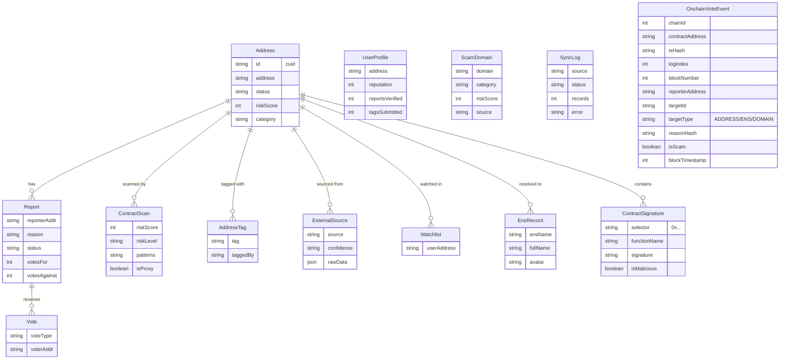

## 1. State Management

### 1.1 Server State (React Query)

Used for caching and fetching data from API routes.

**Pattern in client components:**
```typescript
const { data, isLoading, error } = useQuery({
  queryKey: ['scan', address],
  queryFn: () => fetch(`/api/v1/scan/${address}`).then(r => r.json()),
  enabled: !!address,
})
```

### 1.2 Wallet State (Wagmi)

Wagmi automatically manages wallet state:
- Connection status
- Connected address
- Chain ID
- Balance

**Usage:**
```typescript
import { useAccount, useConnect, useDisconnect } from 'wagmi'

const { address, isConnected, chain } = useAccount()
const { connect } = useConnect()
const { disconnect } = useDisconnect()
```

### 1.3 Server Components

Dashboard pages use **server components** (default in Next.js App Router):
- Direct database access via Prisma
- No client-side JavaScript for data fetching
- Faster initial page load

### 1.4 Local UI State

Modals, form inputs, and toggles use React `useState`.

---

## 2. Database Schema

### 2.1 Entity Relationship



### 2.2 Enums

| Enum | Values |
|------|--------|
| `AddressStatus` | `LEGIT`, `SCAM`, `SUSPICIOUS`, `UNKNOWN` |
| `AddressCategory` | `DEFI`, `NFT`, `BRIDGE`, `DEX`, `LENDING`, `PHISHING`, `DRAINER`, `AIRDROP_SCAM`, `RUGPULL`, `IMPOSTER`, `OTHER` |
| `AddressType` | `EOA`, `SMART_CONTRACT`, `PROXY`, `FACTORY` |
| `ContractType` | `DEX`, `NFT`, `TOKEN_20`, `TOKEN_721`, `TOKEN_1155`, `BRIDGE`, `LENDING`, `STAKING`, `YIELD`, `GOVERNANCE`, `MULTISIG`, `AIRDROP`, `MINTER`, `DRAINER`, `PHISHING`, `IMPOSTER`, `ROUTER`, `VAULT`, `FACTORY`, `OTHER` |
| `DataSource` | `COMMUNITY`, `SCANNER`, `EXTERNAL`, `SEED`, `ADMIN` |
| `ReportStatus` | `PENDING`, `VERIFIED`, `REJECTED`, `DISPUTED` |
| `VoteType` | `FOR`, `AGAINST` |
| `RiskLevel` | `LOW`, `MEDIUM`, `HIGH`, `CRITICAL` |
| `TargetType` | `ADDRESS`, `ENS`, `DOMAIN` |

### 2.3 Key Indexes

The Address table has comprehensive indexing:
- `status`, `category`, `riskScore`, `source`, `chain` (individual)
- `(source, chain, status)` — composite for filtered queries
- `(status, riskScore)` — scam filtering
- `(addressType)`, `(contractType)` — type filtering
- `(firstSeenAt)`, `(lastSeenAt)` — time-based queries
- `(status, firstSeenAt)` — recent scams

ContractScan indexes: `riskLevel`, `createdAt`, `addressId`, `bytecodeHash` (similarity), `isProxy`, `checkerAddress`

OnchainVoteEvent indexes: `(txHash, logIndex)` unique, `(chainId, blockNumber)`, `(targetId, targetType)`, `reporterAddress`, `reasonHash`

### 2.4 Prisma Client (`lib/prisma.ts`)

Uses **PostgreSQL adapter** (`@prisma/adapter-pg`) for connection pooling:

```typescript
const pool = new pg.Pool({
  connectionString: process.env.DIRECT_URL ?? process.env.DATABASE_URL,
})
const adapter = new PrismaPg(pool)
const prisma = new PrismaClient({ adapter })
```

**Singleton pattern** — prevents multiple instances during development (hot reload).
