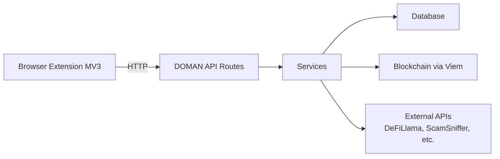
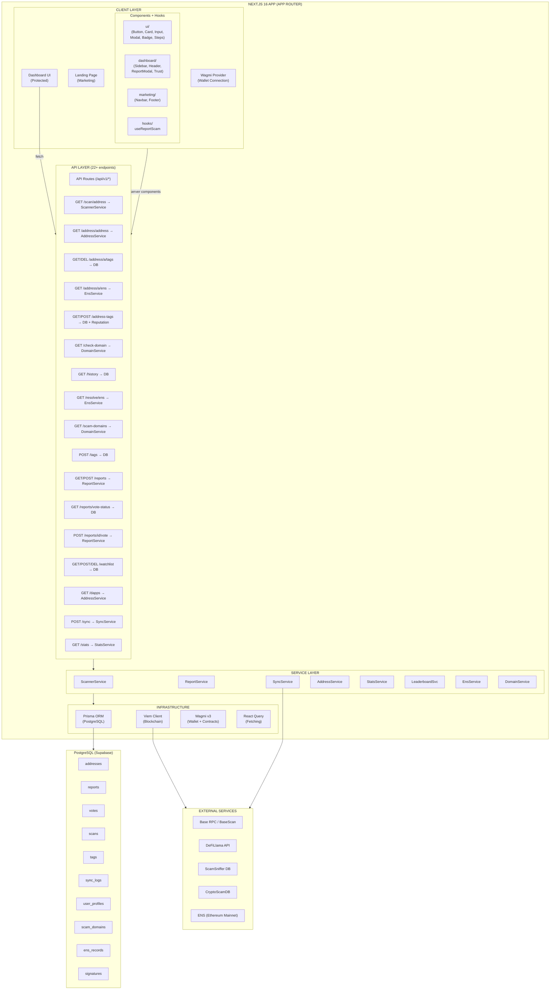

# DOMAN — Frontend End-to-End Documentation

> **Web Application: Community-Powered Security & Decision Engine for Base Chain**
> Version 1.0.0 | Last Updated: 26 April 2026

---

## Table of Contents

1. [Introduction](#1-introduction)
2. [System Architecture](#2-system-architecture)
3. [Tech Stack](#3-tech-stack)
4. [Project Structure](#4-project-structure)

---

## 1. Introduction

### 1.1 What is DOMAN Frontend?

DOMAN Frontend is a **web application** that serves as the main dashboard and API backend for a Web3 security platform on the Base chain. The application provides:

- **Interactive Dashboard** — Platform statistics, scan history, watchlist, tag management
- **Address Checker** — Real-time scanning of address/ENS/domain with risk assessment
- **Community Reporting** — Scam report system with voting and reputation
- **Contract Scanner** — Smart contract bytecode analysis for scam pattern detection
- **REST API** — Backend API consumed by the browser extension and frontend

### 1.2 Relationship with Extension

This frontend is the **backend + dashboard** that serves the browser extension:



### 1.3 Target Users

- Base chain users who need a dashboard for in-depth analysis
- Web3 community members who report and verify scams
- Security researchers who want to analyze smart contracts
- dApp developers who want to verify their contracts

---

## 2. System Architecture



---

## 3. Tech Stack

| Component          | Technology                         | Version |
| ------------------ | ---------------------------------- | ------- |
| Framework          | Next.js (App Router)               | 16.2.3  |
| UI Library         | React                              | 19.2.4  |
| Language           | TypeScript                         | 5.x     |
| Styling            | Tailwind CSS                       | 4.x     |
| ORM                | Prisma                             | 7.7.0   |
| Database           | PostgreSQL (Supabase)              | -       |
| Blockchain Client  | Viem                               | 2.48.0  |
| Wallet Integration | Wagmi                              | 3.6.4   |
| Data Fetching      | TanStack React Query               | 5.100.1 |
| Validation         | Zod                                | 3.25.76 |
| Icons              | Lucide React                       | 1.8.0   |
| Date Utilities     | date-fns                           | 3.6.0   |
| ID Generation      | nanoid                             | 5.1.9   |
| Chain              | Base (8453) / Base Sepolia (84532) | -       |

---

## 4. Project Structure

```
wallo/                                    # Project root
├── package.json                          # Dependencies & scripts
├── next.config.ts                        # Next.js configuration
├── tsconfig.json                         # TypeScript config (strict mode)
├── postcss.config.mjs                    # PostCSS + Tailwind v4
├── prisma.config.ts                      # Prisma config (adapter + pool)
├── .env.local                            # Environment variables (not committed)
├── .env.example                          # Environment template
├── ScamReporter.json                     # Compiled ScamReporter contract artifact
│
├── app/                                  # Next.js App Router
│   ├── layout.tsx                        # Root layout (fonts, metadata)
│   ├── providers.tsx                     # Client providers (Wagmi, React Query)
│   ├── globals.css                       # Global styles + CSS variables
│   │
│   ├── (marketing)/                      # Marketing route group
│   │   └── page.tsx                      # Landing page
│   │
│   ├── (dashboard)/                      # Dashboard route group
│   │   └── dashboard/
│   │       ├── layout.tsx                # Dashboard layout (sidebar + header)
│   │       ├── page.tsx                  # Overview / stats
│   │       ├── checker/page.tsx          # Address checker + voting
│   │       ├── deploy/page.tsx           # Deploy ScamReporter contract
│   │       ├── history/page.tsx          # Scan history
│   │       ├── settings/page.tsx         # Settings
│   │       ├── tags/page.tsx             # Tag management (server wrapper)
│   │       │   └── tags-client.tsx       # Tag management client
│   │       └── watchlist/page.tsx        # Watchlist + add/remove
│   │
│   └── api/                              # API routes
│       ├── health/route.ts               # Health check
│       └── v1/
│           ├── scan/[address]/route.ts   # Contract/ENS/domain scanning
│           ├── address/[address]/route.ts # Address details
│           │   ├── ens/route.ts          # ENS resolution for address (GET)
│           │   └── tags/route.ts         # Address tags (GET, DELETE)
│           ├── address-tags/route.ts     # Tag CRUD with reputation (GET, POST)
│           ├── check-domain/route.ts     # Domain scam check (GET)
│           ├── history/route.ts          # Scan history (GET)
│           ├── resolve/[ens]/route.ts    # ENS name resolution (GET)
│           ├── scam-domains/route.ts     # Scam domain listing (GET)
│           ├── tags/route.ts             # Simplified tag creation (POST)
│           ├── reports/route.ts          # Reports CRUD
│           │   └── vote-status/route.ts  # Check if user voted (GET)
│           │   └── [id]/
│           │       ├── route.ts          # Report detail
│           │       └── vote/route.ts     # Vote on report
│           ├── watchlist/route.ts        # Watchlist (GET, POST)
│           │   └── [address]/route.ts    # Watchlist remove (DELETE)
│           ├── dapps/route.ts            # dApps directory
│           ├── sync/route.ts             # External data sync
│           └── stats/route.ts            # Platform statistics
│
├── components/                           # React components
│   ├── ui/                               # Reusable primitives
│   │   ├── button.tsx                    # Button variants (primary/secondary/ghost/danger)
│   │   ├── card.tsx                      # Card container
│   │   ├── input.tsx                     # Styled input field
│   │   ├── modal.tsx                     # Full-screen modal with backdrop
│   │   ├── badge.tsx                     # Status badges + TrustScoreBadge
│   │   └── steps.tsx                     # Multi-step indicator (57 lines)
│   │
│   ├── dashboard/                        # Dashboard-specific
│   │   ├── sidebar.tsx                   # Navigation sidebar
│   │   ├── header.tsx                    # Header + WalletButton
│   │   ├── report-scam-modal.tsx         # Multi-step scam report
│   │   └── trust-score-badge.tsx         # Trust score display (45 lines)
│   │
│   └── marketing/                        # Marketing page components
│       ├── navbar.tsx                    # Navigation bar
│       └── footer.tsx                    # Footer
│
├── hooks/                                # Custom React hooks
│   └── use-report-scam.ts               # Scam reporting workflow
│
├── config/                               # Configuration modules
│   ├── chains.ts                         # Base chain definitions
│   ├── contracts.ts                      # ScamReporter ABI + addresses
│   ├── endpoints.ts                      # External API endpoints
│   └── scam-patterns.ts                  # Scam detection patterns
│
├── lib/                                  # Utility libraries
│   ├── api-response.ts                   # API response builders
│   ├── constants.ts                      # App-wide constants
│   ├── error-handler.ts                  # Centralized error handling
│   ├── hash.ts                           # Keccak256 hashing (35 lines)
│   ├── prisma.ts                         # Prisma singleton with pg adapter
│   ├── utils.ts                          # Utility functions
│   ├── validation.ts                     # Zod schemas
│   ├── viem.ts                           # Blockchain client + ENS
│   └── wagmi.ts                          # Wallet config (28 lines)
│
├── services/                             # Business logic layer
│   ├── scanner-service.ts                # Contract scanning + domain + batch
│   ├── report-service.ts                 # Report management (355 lines)
│   ├── sync-service.ts                   # External data sync (523 lines)
│   ├── address-service.ts                # Address management (455 lines)
│   ├── stats-service.ts                  # Statistics aggregation (81 lines)
│   ├── leaderboard-service.ts            # Reputation system (411 lines)
│   ├── ens-service.ts                    # ENS resolution + caching (153 lines)
│   └── domain-service.ts                 # Domain scam checking (196 lines)
│
├── types/                                # TypeScript type definitions
│   ├── api.ts                            # API request/response types
│   └── models.ts                         # Database model types
│
├── prisma/                               # Database
│   ├── schema.prisma                     # Prisma schema
│   ├── seed.ts                           # Seed data script
│   └── migrations/                       # SQL migration files
│       ├── 20260418_*.sql                # Initial schema + address enhancements
│       ├── 20260420_*.sql                # Contract scans + function signatures
│       ├── 20260421_*.sql                # Watchlist support
│       └── migration_lock.toml           # Migration lock
│
└── public/                               # Static assets
    ├── logo1.png                         # Brand logo variant
    └── logo2.png                         # Brand logo variant
```
