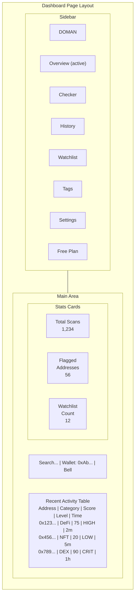
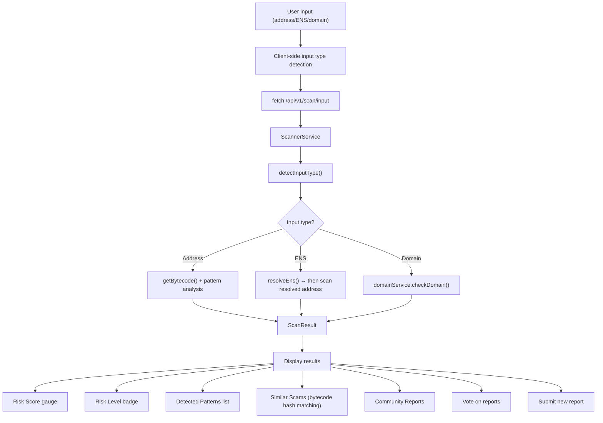
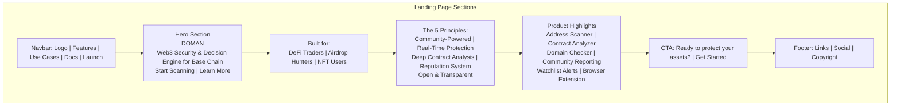

## 1. Routing & Pages

### 1.1 Route Structure

```
/                          → Landing Page (Marketing)
/dashboard                 → Dashboard Overview (stats)
/dashboard/checker         → Address/Contract Checker + Voting
/dashboard/deploy          → Deploy ScamReporter Contract
/dashboard/history         → Scan History
/dashboard/watchlist       → Watchlist Management (add/remove)
/dashboard/tags            → Tag Management (search + add)
/dashboard/settings        → Settings

/api/health                → Health Check
/api/v1/scan/[address]     → Scan Address/ENS/Domain
/api/v1/address/[address]  → Address Details
/api/v1/address/[addr]/ens → ENS Resolution for address
/api/v1/address/[addr]/tags → Address Tags (GET, DELETE)
/api/v1/address-tags       → Tag CRUD + Reputation (GET, POST)
/api/v1/check-domain       → Domain Scam Check
/api/v1/history            → Scan History
/api/v1/resolve/[ens]      → ENS Name Resolution
/api/v1/scam-domains       → Scam Domain Listing
/api/v1/tags               → Simplified Tag Creation
/api/v1/reports            → Reports (GET list, POST create)
/api/v1/reports/vote-status → Check Vote Status
/api/v1/reports/[id]/vote  → Vote on Report
/api/v1/watchlist          → Watchlist (GET, POST)
/api/v1/watchlist/[address] → Remove from Watchlist (DELETE)
/api/v1/dapps              → dApps Directory
/api/v1/sync               → External Data Sync
/api/v1/stats              → Platform Statistics
```

### 1.2 Route Groups

| Group | Layout | Purpose |
|-------|--------|---------|
| `(marketing)` | Public, no auth | Landing page, SEO |
| `(dashboard)` | Sidebar + Header | Protected dashboard area |
| `api/` | API handlers | REST endpoints |

### 1.3 Page Details

#### Landing Page (`/`)
- Hero section with gradient text and CTA
- Use cases: DeFi Traders, Airdrop Hunters, NFT Users
- Features manifesto (5 core features)
- Product highlights
- CTA sections
- Pure marketing, no wallet required

#### Dashboard Overview (`/dashboard`)
- Stats cards: Total Scans, Flagged Addresses, Watchlist Count, Avg Trust Score
- Recent Activity table: address, category, chain, score, risk level, timestamp
- Server component that queries the database directly

#### Checker (`/dashboard/checker`)
- Input field for address/ENS/domain
- URL query parameter pre-filling (`?address=0x...`)
- Real-time scan with loading states
- Result display: risk score (trust score = 100 - riskScore), risk level, detected patterns, similar scams
- Community voting section:
  - FOR/AGAINST vote buttons with wallet-based validation
  - Real-time vote status check (`/api/v1/reports/vote-status`)
  - Sentiment bar (visual vote ratio)
  - Already-voted indicators
- Report Scam button → opens multi-step modal
- Direct link to block explorer
- Trust score badge visual

#### Deploy (`/dashboard/deploy`)
- Deploy ScamReporter smart contract to Base Sepolia
- Wallet connection + chain switch (auto-switch to Base Sepolia)
- Contract info card: name, compiler, function signatures, gas estimate (~22-24k per call)
- Real-time deployment status tracking (idle → deploying → success → error)
- Success state: transaction hash, BaseScan link, configuration guide
- Uses `useWriteContract` from wagmi for on-chain deployment

#### History (`/dashboard/history`)
- Table of previous scan history
- Columns: address, name, category, chain, score, risk level, timestamp
- Sortable and paginated

#### Watchlist (`/dashboard/watchlist`)
- List of watched addresses
- Add/remove functionality
- Score tracking with trend indicators
- Auto-refresh periodically

#### Tags (`/dashboard/tags`)
- Server component wrapper + `TagsClient` client component (185 lines)
- Search bar: filter by address or tag name
- Address cards with existing tag badges
- Inline add tag form per address
- Tag attribution: shows who tagged (taggedBy)
- Status-based badge variants (LEGIT=green, SUSPICIOUS=yellow, SCAM=red)
- Real-time tag updates without page refresh

#### Settings (`/dashboard/settings`)
- Profile section (wallet address, ENS)
- Notification preferences
- API keys section (placeholder)
- Security settings

---

## 2. Layout & Providers

### 2.1 Root Layout (`app/layout.tsx`)

```tsx
<html lang="en" className="h-full antialiased">
  <body className="min-h-full flex flex-col">
    <Providers>{children}</Providers>
  </body>
</html>
```

**Fonts:**
- **Space Grotesk** — Body text (`--font-space-grotesk`)
- **Geist Mono** — Code/monospace (`--font-geist-mono`)

**Metadata:**
- Title: "Doman — Web3 Security & Decision Engine"
- Description: "Scan addresses, contracts, and domains before you interact..."

### 2.2 Providers (`app/providers.tsx`)

Client component that wraps the entire app with:

```tsx
<WagmiProvider config={wagmiConfig}>
  <QueryClientProvider client={queryClient}>
    {children}
  </QueryClientProvider>
</WagmiProvider>
```

| Provider | Library | Purpose |
|----------|---------|---------|
| `WagmiProvider` | wagmi v3 | Wallet connection & blockchain interaction |
| `QueryClientProvider` | @tanstack/react-query | Server state management & caching |

**SSR-safe pattern:** `QueryClient` is created per mount via `useState(() => new QueryClient())`.

### 2.3 Dashboard Layout

The dashboard uses a dedicated layout with:
- **Sidebar** — Fixed navigation on the left (collapsible on mobile)
- **Header** — Search bar + wallet connection button + notifications

---

## 3. UI Components

### 3.1 Primitives (`components/ui/`)

#### Button (`button.tsx`)
Variants:
| Variant | Style | Use Case |
|---------|-------|----------|
| `primary` | Blue gradient + glow | Main CTA |
| `secondary` | Dark border | Secondary actions |
| `ghost` | Transparent | Subtle actions |
| `danger` | Red | Destructive actions |

Sizes: `sm`, `md`, `lg`. Support for `asChild` (render as link).

#### Card (`card.tsx`)
Basic wrapper: `rounded-xl border border-card-border bg-card p-6`.

#### Input (`input.tsx`)
Styled input with focus states and border styling.

#### Modal (`modal.tsx`)
- Full-screen overlay with backdrop blur
- Keyboard escape support
- Body scroll prevention
- Configurable title and max-width

#### Badge (`badge.tsx`)
Color-coded status badges + specialized `TrustScoreBadge`.

### 3.2 Dashboard Components (`components/dashboard/`)

#### Sidebar (`sidebar.tsx`)
- Navigation items: Overview, Checker, History, Watchlist, Tags, Settings
- Active state indicator
- Mobile responsive (collapsible)
- User plan indicator

#### Header (`header.tsx`)
- Search bar
- `WalletButton` — Connect/disconnect wallet, copy address
- Notification bell

#### Report Scam Modal (`report-scam-modal.tsx`)
Multi-step wizard:
1. **Details** — Input address, select reasons, add evidence
2. **Preview** — Review report before submit
3. **Confirm** — Submit with optional on-chain transaction

#### Trust Score Badge (`trust-score-badge.tsx`)
Visual trust score:
| Range | Variant | Color |
|-------|---------|-------|
| 0-20 | safe | Green |
| 21-60 | warning | Yellow/Amber |
| 61-80 | danger | Orange |
| 81-100 | unknown | Red |

---

## 4. Dashboard

### 4.1 Dashboard Layout



### 4.2 Checker Page Flow



---

## 5. Landing Page (Marketing)

### 5.1 Sections


