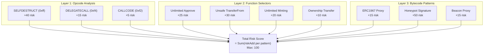
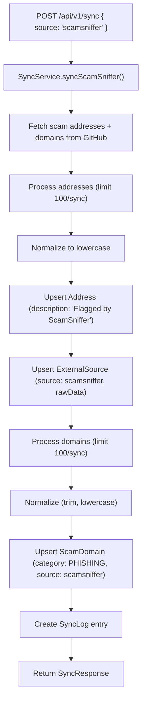

## 1. Scam Detection Engine

### 1.1 Three-Layer Analysis Overview

DOMAN detects scam patterns through three layers of analysis:



**Implementation notes**

1. **Opcode parsing is hardened** — detection skips PUSH data to reduce false positives from embedded constants.
2. **Weighted scoring** — risk score uses `riskAdd` from `config/scam-patterns`.
3. **Governance/voting contracts** — ScamReporter selectors are classified as `GOVERNANCE`.
4. **Similar scams** — only returned when `bytecodeHash` matches existing scans.

### 1.2 Pattern System (`config/scam-patterns.ts`)

Four pattern categories:

#### Opcode Patterns

| Pattern                     | Severity | Risk Add |
| --------------------------- | -------- | -------- |
| Self-Destruct (`0xff`)      | CRITICAL | +40      |
| Delegate Call (`0xf4`)      | MEDIUM   | +15      |
| Obsolete CALLCODE (`0xf2`)  | LOW      | +5       |
| External Code Hash (`0x3f`) | LOW      | +5       |

#### Function Selector Patterns

| Pattern              | Selector     | Severity | Risk Add |
| -------------------- | ------------ | -------- | -------- |
| Unlimited Approve    | `0x095ea7b3` | HIGH     | +25      |
| Unsafe Transfer From | `0x23b872dd` | HIGH     | +30      |
| Ownership Transfer   | `0xf2fde38b` | LOW      | +10      |
| Renounce Ownership   | `0x715018a6` | LOW      | +5       |
| Contract Pause       | `0x8456cb59` | MEDIUM   | +10      |
| Unlimited Minting    | `0x40c10f19` | HIGH     | +20      |
| Burn From            | `0x79cc6790` | MEDIUM   | +15      |
| Multicall            | `0xac9650d8` | LOW      | +5       |

#### Bytecode Patterns

| Pattern                     | Severity | Risk Add |
| --------------------------- | -------- | -------- |
| Upgradeable Proxy (ERC1967) | MEDIUM   | +15      |
| Beacon Proxy                | MEDIUM   | +15      |
| Minimal Proxy (EIP-1167)    | LOW      | +10      |
| Honeypot Signature          | CRITICAL | +50      |

#### External Checks

| Pattern           | Severity | Risk Add |
| ----------------- | -------- | -------- |
| Unverified Source | LOW      | +10      |
| Recently Deployed | LOW      | +5       |

### 1.3 Risk Score Calculation

```
totalRiskScore = Σ(matchedPattern.riskAdd)
finalScore = Math.min(totalRiskScore, 100)
```

### 1.4 Risk Level Thresholds

| Level    | Score Range |
| -------- | ----------- |
| LOW      | 0 — 40      |
| MEDIUM   | 41 — 60     |
| HIGH     | 61 — 80     |
| CRITICAL | 81 — 100    |

### 1.5 Similarity Detection

Similar scams are returned only when `bytecodeHash` matches existing scans.

---

## 2. External Data Sync

### 2.1 Data Sources

| Source            | Type       | Data                                       | Frequency |
| ----------------- | ---------- | ------------------------------------------ | --------- |
| **DeFiLlama**     | REST API   | DeFi protocols, TVL, contract addresses    | On-demand |
| **ScamSniffer**   | GitHub Raw | Scam addresses, phishing domains, drainers | On-demand |
| **CryptoScamDB**  | REST API   | Scam entries, categories, descriptions     | On-demand |
| **Base Registry** | Web Scrape | Official dApps, bridges, ecosystem         | Manual    |

### 2.2 External API Config (`config/endpoints.ts`)

```typescript
defiLlamaConfig.baseUrl     → 'https://api.llama.fi'
scamSnifferConfig.rawUrl    → 'https://raw.githubusercontent.com/scamsniffer/...'
cryptoScamDbConfig.baseUrl  → 'https://cryptoscamdb.org/api'
baseRegistryConfig.baseUrl  → 'https://base.org'
baseScanConfig.baseUrl      → 'https://sepolia.basescan.org'
```

### 2.3 Sync Flow



### 2.4 Sync Log

Every sync operation is recorded in the `SyncLog` table:

- source, status (success/failed)
- recordsAdded, recordsUpdated
- startedAt, completedAt
- error (if failed)
