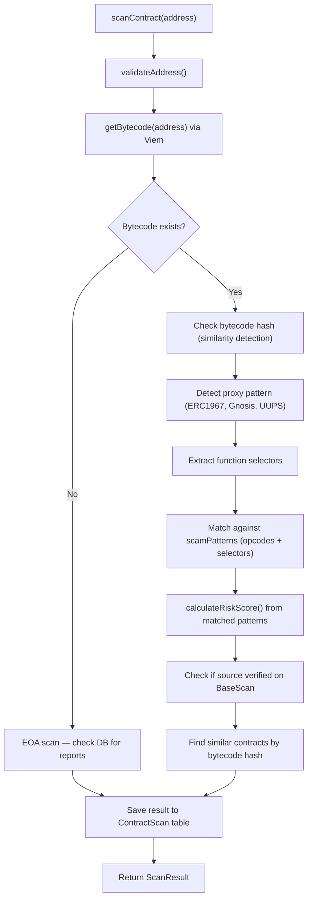
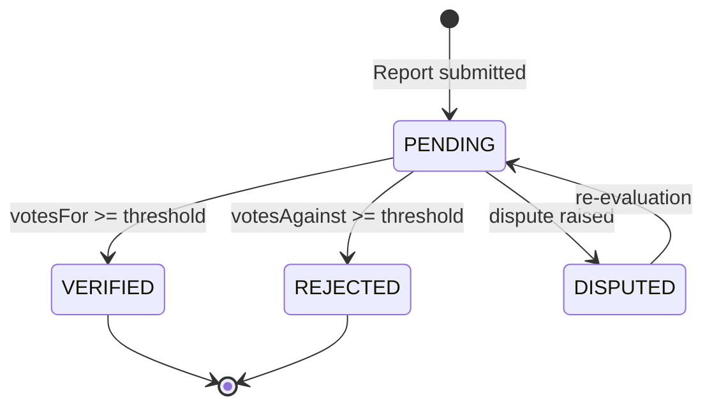
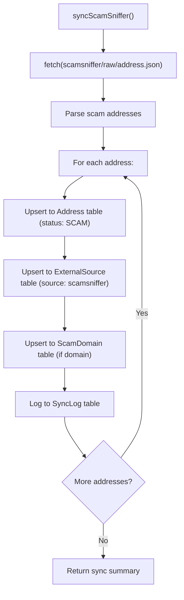

## 1. Service Layer

### 1.1 Architecture

Each service follows the pattern:
- Pure functions (stateless)
- Accepts `prisma` as an implicit dependency (via singleton import)
- Returns typed data structures
- Throws `AppError` for business logic errors

### 1.2 Scanner Service (`scanner-service.ts`)

Core scanning engine for smart contract analysis.

**Functions:**

| Function | Input | Output | Description |
|----------|-------|--------|-------------|
| `scanContract` | address | `ScanResult` | Full contract scan (bytecode + patterns) |
| `quickScan` | address | `QuickScanResult` | Lightweight DB-only scan |
| `detectAddressType` | address | `AddressType` | EOA / SMART_CONTRACT / PROXY / FACTORY |
| `scanDomain` | domain | `DomainCheckResult` | Domain scam check |
| `batchScan` | address[] | `BatchScanResult` | Batch scanning (max 25) |

**Scan Flow:**

### 1.3 Report Service (`report-service.ts`)

Community report management with voting and reputation.

**Functions:**

| Function | Description |
|----------|-------------|
| `createReport` | Create a new report, hash reason, award reputation |
| `getReports` | Paginated list with filters |
| `voteOnReport` | Vote FOR/AGAINST, check reputation threshold |
| `getReportsByAddress` | Reports for a specific address |
| `resolveReport` | Auto-resolve based on vote threshold |

**Report Lifecycle:**

### 1.4 Address Service (`address-service.ts`)

**Functions:**

| Function | Description |
|----------|-------------|
| `getAddress` | Get address detail with tags, reports, scans |
| `getDApps` | List dApps with filters and pagination |
| `searchAddresses` | Search by name or address |
| `getPopularDApps` | Top dApps by TVL |
| `getSimilarAddresses` | Find similar contracts |

### 1.5 Sync Service (`sync-service.ts`)

Data synchronization from external sources.

**Functions:**

| Function | Source | Description |
|----------|--------|-------------|
| `syncDefiLlama` | DeFiLlama API | Sync DeFi protocol data (TVL, addresses) |
| `syncScamSniffer` | ScamSniffer GitHub | Sync scam addresses + domains |
| `syncCryptoScamDB` | CryptoScamDB API | Sync additional scam data |
| `runAllSyncs` | All | Run all sync sources |

**Sync Flow:**

### 1.6 Stats Service (`stats-service.ts`)

Platform statistics aggregation: address counts by status, report counts, category distributions.

### 1.7 Leaderboard Service (`leaderboard-service.ts`)

User reputation system:

| Action | Points |
|--------|--------|
| Report submitted | +1 |
| Report verified | +10 |
| Correct vote | +2 |
| Wrong vote | -1 |
| Scan completed | +1 |

**Reputation Levels:**

| Level | Points | Name |
|-------|--------|------|
| 0-49 | Beginner |
| 50-199 | Trusted |
| 200-499 | Expert |
| 500+ | Master |

### 1.8 ENS Service (`ens-service.ts`)

- `resolveEns(name)` — .eth → 0x address
- `reverseResolveEns(address)` — 0x → .eth name
- `getEnsAvatar(name)` — Get ENS avatar URL
- `getEnsRecordsForAddress(address)` — All ENS records
- Database caching (EnsRecord table)

### 1.9 Domain Service (`domain-service.ts`)

- `checkDomain(domain)` — Check if domain is known scam
- `listScamDomains(filters)` — Paginated scam domain list
- `upsertScamDomain(data)` — Add/update scam domain
- `batchCheckDomains(domains[])` — Batch domain check
