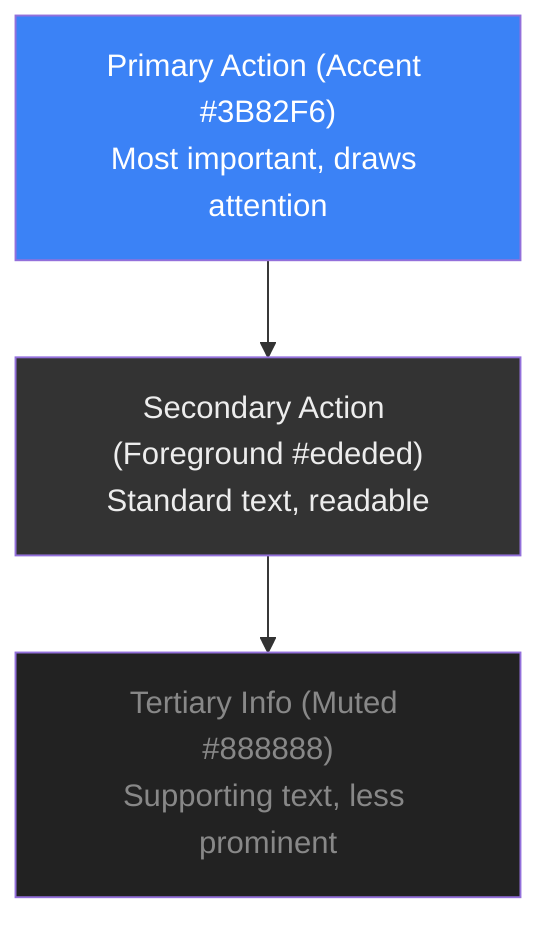

# Doman Extension Design Guide

**Version:** 1.1
**Date:** 2026-04-26
**Based on:** Dashboard Design System v1.1

---

## Table of Contents

1. [Design Principles](#design-principles)
2. [Color System](#color-system)
3. [Typography](#typography)
4. [Spacing & Layout](#spacing--layout)
5. [Components](#components)
6. [Icons](#icons)
7. [Animations](#animations)
8. [Extension-Specific UI](#extension-specific-ui)
9. [CSS Framework](#css-framework)

---

## Design Principles

### Core Values

1. **Dark First** - All interfaces use a dark theme for reduced eye strain
2. **High Contrast** - Critical information stands out with the accent color
3. **Trust Signals** - Green for safe, Red for danger, Yellow for caution
4. **Minimal Friction** - Users get what they need with minimal clicks
5. **Mobile Responsive** - Works on all screen sizes

### Visual Hierarchy



---

## Color System

### Base Colors

| Role        | CSS Variable    | Value     | Usage                     |
| ----------- | --------------- | --------- | ------------------------- |
| Background  | `--background`  | `#000000` | Main background           |
| Foreground  | `--foreground`  | `#E5E7EB` | Primary text              |
| Accent      | `--accent`      | `#3B82F6` | CTAs, links, highlights   |
| Accent Dark | `--accent-dark` | `#2563EB` | Hover states              |
| Glow        | `--glow`        | `#22D3EE` | Gradient/glow accents     |
| Muted       | `--muted`       | `#9CA3AF` | Secondary text            |
| Card        | `--card`        | `#0D0D0D` | Card backgrounds          |
| Card Border | `--card-border` | `#1F1F1F` | Borders, dividers         |
| Surface     | `--surface`     | `#0A0A0A` | Inputs, elevated surfaces |

### Status Colors

| Status  | Background                 | Border                     | Text      | Usage       |
| ------- | -------------------------- | -------------------------- | --------- | ----------- |
| Safe    | `rgba(34, 197, 94, 0.2)`   | `rgba(34, 197, 94, 0.3)`   | `#4ade80` | Score >= 70  |
| Warning | `rgba(234, 179, 8, 0.2)`   | `rgba(234, 179, 8, 0.3)`   | `#facc15` | Score 40-69 |
| Danger  | `rgba(239, 68, 68, 0.2)`   | `rgba(239, 68, 68, 0.3)`   | `#f87171` | Score < 40  |
| Unknown | `rgba(113, 113, 122, 0.2)` | `rgba(113, 113, 122, 0.3)` | `#a1a1aa` | No data     |

### Color Usage Guidelines

```css
/* DO - Use accent for primary actions */
<button className="bg-accent text-white">Check Address</button>

/* DON'T - Don't overuse accent */
<div className="bg-accent">Large content area</div>

/* DO - Use muted for supporting text */
<p className="text-muted">Last checked 2 hours ago</p>

/* DON'T - Don't use muted for critical info */
<p className="text-muted">SCAM DETECTED</p>  /* Wrong! */
```

---

## Typography

### Font Families

```css
/* Sans-serif - Headings, UI elements */
font-family:
  "Space Grotesk",
  system-ui,
  -apple-system,
  sans-serif;

/* Monospace - Addresses, code, hashes */
font-family: "Geist Mono", "SF Mono", Consolas, monospace;
```

### Type Scale

| Usage               | Size | Weight     | Line Height | Font Family   |
| ------------------- | ---- | ---------- | ----------- | ------------- |
| H1 - Page Title     | 24px | 700 (Bold) | 1.2         | Space Grotesk |
| H2 - Card Title     | 18px | 600 (Semi) | 1.3         | Space Grotesk |
| H3 - Section        | 14px | 600 (Semi) | 1.4         | Space Grotesk |
| Body - Primary      | 14px | 400 (Reg)  | 1.5         | Space Grotesk |
| Body - Small        | 12px | 400 (Reg)  | 1.5         | Space Grotesk |
| Monospace - Address | 13px | 400 (Reg)  | 1.4         | Geist Mono    |

### Typography Examples

```css
/* Page Title */
h1 {
  font-size: 24px;
  font-weight: 700;
  letter-spacing: -0.02em;
  line-height: 1.2;
}

/* Card Title */
h2 {
  font-size: 18px;
  font-weight: 600;
  letter-spacing: -0.01em;
}

/* Address Text */
.address {
  font-family: "Geist Mono", monospace;
  font-size: 13px;
  letter-spacing: 0.01em;
}

/* Uppercase Label */
.label {
  font-size: 12px;
  font-weight: 600;
  text-transform: uppercase;
  letter-spacing: 0.05em;
}
```

---

## Spacing & Layout

### Spacing Scale

| Token | Value | Usage                    |
| ----- | ----- | ------------------------ |
| `xs`  | 4px   | Tight spacing, icon gaps |
| `sm`  | 8px   | Small gaps, padding-sm   |
| `md`  | 16px  | Default spacing          |
| `lg`  | 24px  | Section spacing          |
| `xl`  | 32px  | Large gaps               |
| `2xl` | 48px  | Component separation     |

### Border Radius

| Size   | Value  | Usage                |
| ------ | ------ | -------------------- |
| `sm`   | 8px    | Small elements, tags |
| `md`   | 12px   | Cards, buttons       |
| `lg`   | 16px   | Large cards, modals  |
| `full` | 9999px | Pills, badges        |

### Layout Patterns

```css
/* Card with padding */
.card {
  padding: 24px;
  border-radius: 16px;
  border: 1px solid var(--card-border);
  background: var(--card);
}

/* Flex row with gap */
.row {
  display: flex;
  align-items: center;
  gap: 12px;
}

/* Grid for stats */
.stats-grid {
  display: grid;
  grid-template-columns: repeat(2, 1fr);
  gap: 16px;
}

@media (min-width: 768px) {
  .stats-grid {
    grid-template-columns: repeat(4, 1fr);
  }
}
```

---

## Components

### Button

```css
/* Primary Button */
.btn-primary {
  background: var(--accent);
  color: #ffffff;
  padding: 12px 24px;
  border-radius: 9999px;
  font-weight: 600;
  font-size: 14px;
  border: none;
  cursor: pointer;
  transition: background 0.15s ease;
}

.btn-primary:hover {
  background: var(--accent-dark);
}

/* Secondary Button */
.btn-secondary {
  background: transparent;
  color: var(--foreground);
  padding: 12px 24px;
  border-radius: 9999px;
  font-size: 14px;
  border: 1px solid var(--card-border);
  cursor: pointer;
  transition: all 0.15s ease;
}

.btn-secondary:hover {
  background: var(--surface);
  border-color: var(--muted);
}

/* Ghost Button */
.btn-ghost {
  background: transparent;
  color: var(--muted);
  padding: 8px 12px;
  border-radius: 8px;
  font-size: 14px;
  border: none;
  cursor: pointer;
  transition: color 0.15s ease;
}

.btn-ghost:hover {
  color: var(--foreground);
}

/* Danger Button */
.btn-danger {
  background: #dc2626;
  color: #ffffff;
  padding: 12px 24px;
  border-radius: 9999px;
  font-weight: 600;
  font-size: 14px;
  border: none;
  cursor: pointer;
  transition: background 0.15s ease;
}

.btn-danger:hover {
  background: #b91c1c;
}
```

### Input

```css
.input {
  width: 100%;
  background: var(--surface);
  border: 1px solid var(--card-border);
  border-radius: 12px;
  padding: 12px 16px;
  color: var(--foreground);
  font-size: 14px;
  outline: none;
  transition: all 0.15s ease;
}

.input::placeholder {
  color: var(--muted);
}

.input:focus {
  border-color: var(--accent);
  box-shadow: 0 0 0 1px var(--accent);
}

.input-with-icon {
  position: relative;
}

.input-with-icon input {
  padding-left: 40px;
}

.input-with-icon .icon {
  position: absolute;
  left: 12px;
  top: 50%;
  transform: translateY(-50%);
  color: var(--muted);
  pointer-events: none;
}
```

### Card

```css
.card {
  background: var(--card);
  border: 1px solid var(--card-border);
  border-radius: 16px;
  padding: 24px;
}

.card-header {
  display: flex;
  align-items: center;
  justify-content: space-between;
  margin-bottom: 16px;
}

.card-title {
  font-size: 18px;
  font-weight: 600;
}

.card-body {
  color: var(--foreground);
}

.card-footer {
  margin-top: 16px;
  padding-top: 16px;
  border-top: 1px solid var(--card-border);
}
```

### Badge

```css
/* Safe Badge */
.badge-safe {
  display: inline-flex;
  align-items: center;
  padding: 4px 12px;
  border-radius: 9999px;
  font-size: 12px;
  font-weight: 500;
  background: rgba(34, 197, 94, 0.2);
  border: 1px solid rgba(34, 197, 94, 0.3);
  color: #4ade80;
}

/* Warning Badge */
.badge-warning {
  display: inline-flex;
  align-items: center;
  padding: 4px 12px;
  border-radius: 9999px;
  font-size: 12px;
  font-weight: 500;
  background: rgba(234, 179, 8, 0.2);
  border: 1px solid rgba(234, 179, 8, 0.3);
  color: #facc15;
}

/* Danger Badge */
.badge-danger {
  display: inline-flex;
  align-items: center;
  padding: 4px 12px;
  border-radius: 9999px;
  font-size: 12px;
  font-weight: 500;
  background: rgba(239, 68, 68, 0.2);
  border: 1px solid rgba(239, 68, 68, 0.3);
  color: #f87171;
}

/* Unknown Badge */
.badge-unknown {
  display: inline-flex;
  align-items: center;
  padding: 4px 12px;
  border-radius: 9999px;
  font-size: 12px;
  font-weight: 500;
  background: rgba(113, 113, 122, 0.2);
  border: 1px solid rgba(113, 113, 122, 0.3);
  color: #a1a1aa;
}
```

### Trust Score Badge

```css
.trust-badge {
  display: inline-flex;
  align-items: center;
  gap: 6px;
  padding: 6px 14px;
  border-radius: 9999px;
  font-size: 12px;
  font-weight: 500;
}

.trust-badge.safe {
  background: rgba(34, 197, 94, 0.2);
  border: 1px solid rgba(34, 197, 94, 0.3);
  color: #4ade80;
}

.trust-badge.warning {
  background: rgba(234, 179, 8, 0.2);
  border: 1px solid rgba(234, 179, 8, 0.3);
  color: #facc15;
}

.trust-badge.danger {
  background: rgba(239, 68, 68, 0.2);
  border: 1px solid rgba(239, 68, 68, 0.3);
  color: #f87171;
}
```

### Progress Bar

```css
.progress-container {
  width: 100%;
  height: 8px;
  background: var(--surface);
  border-radius: 9999px;
  overflow: hidden;
}

.progress-bar {
  height: 100%;
  background: var(--accent);
  border-radius: 9999px;
  transition: width 0.3s ease;
}

.progress-bar.safe {
  background: #4ade80;
}

.progress-bar.warning {
  background: #facc15;
}

.progress-bar.danger {
  background: #f87171;
}
```

### Skeleton Loading

```css
.skeleton {
  background: linear-gradient(
    90deg,
    var(--surface) 0%,
    var(--card-border) 50%,
    var(--surface) 100%
  );
  background-size: 200% 100%;
  animation: skeleton-loading 1.5s ease-in-out infinite;
  border-radius: 8px;
}

@keyframes skeleton-loading {
  0% {
    background-position: 200% 0;
  }
  100% {
    background-position: -200% 0;
  }
}
```

---

## Icons

### Icon Library

Use **Lucide Icons** for consistency with the dashboard.

```bash
npm install lucide
# or CDN
<script src="https://unpkg.com/lucide@latest"></script>
```

### Common Icons

| Icon             | Name          | Usage             |
| ---------------- | ------------- | ----------------- |
| `shield`         | Shield        | Logo, security    |
| `search`         | Search        | Search inputs     |
| `alert-triangle` | AlertTriangle | Warnings, dangers |
| `check-circle`   | CheckCircle   | Success, safe     |
| `x-circle`       | XCircle       | Error, blocked    |
| `clock`          | Clock         | Time, history     |
| `eye`            | Eye           | View, visible     |
| `eye-off`        | EyeOff        | Hide, hidden      |
| `bell`           | Bell          | Notifications     |
| `settings`       | Settings      | Settings menu     |
| `thumbs-up`      | ThumbsUp      | Vote up           |
| `thumbs-down`    | ThumbsDown    | Vote down         |
| `copy`           | Copy          | Copy address      |
| `external-link`  | ExternalLink  | Open externally   |

### Icon Sizing

```css
.icon-xs {
  width: 12px;
  height: 12px;
}
.icon-sm {
  width: 14px;
  height: 14px;
}
.icon-md {
  width: 16px;
  height: 16px;
}
.icon-lg {
  width: 18px;
  height: 18px;
}
.icon-xl {
  width: 20px;
  height: 20px;
}
.icon-2xl {
  width: 24px;
  height: 24px;
}
```

---

## Animations

### Transition Standards

```css
/* Fast interactions (hover, focus) */
.transition-fast {
  transition: all 0.15s ease;
}

/* Default transitions */
.transition-base {
  transition: all 0.2s ease;
}

/* Slow animations (page transitions) */
.transition-slow {
  transition: all 0.3s ease;
}
```

### Keyframe Animations

```css
/* Fade in */
@keyframes fade-in {
  from {
    opacity: 0;
  }
  to {
    opacity: 1;
  }
}

.fade-in {
  animation: fade-in 0.2s ease;
}

/* Slide up */
@keyframes slide-up {
  from {
    opacity: 0;
    transform: translateY(10px);
  }
  to {
    opacity: 1;
    transform: translateY(0);
  }
}

.slide-up {
  animation: slide-up 0.3s ease;
}

/* Pulse for alerts */
@keyframes pulse {
  0%,
  100% {
    opacity: 1;
  }
  50% {
    opacity: 0.5;
  }
}

.pulse {
  animation: pulse 2s ease-in-out infinite;
}

/* Spin for loading */
@keyframes spin {
  from {
    transform: rotate(0deg);
  }
  to {
    transform: rotate(360deg);
  }
}

.spin {
  animation: spin 1s linear infinite;
}
```

---

## Extension-Specific UI

### Popup Structure

```css
/* Popup Container - Fixed size for Chrome */
.popup-container {
  width: 360px;
  min-height: 400px;
  max-height: 600px;
  background: var(--background);
  font-family: "Space Grotesk", sans-serif;
}

/* Popup Header */
.popup-header {
  display: flex;
  align-items: center;
  gap: 12px;
  padding: 16px 20px;
  border-bottom: 1px solid var(--card-border);
  background: var(--card);
}

.popup-logo {
  width: 32px;
  height: 32px;
  background: var(--accent);
  border-radius: 8px;
  display: flex;
  align-items: center;
  justify-content: center;
}

.popup-title {
  font-size: 18px;
  font-weight: 700;
  color: var(--foreground);
}

/* Popup Content */
.popup-content {
  padding: 20px;
  overflow-y: auto;
  max-height: 450px;
}

/* Popup Footer */
.popup-footer {
  padding: 12px 20px;
  border-top: 1px solid var(--card-border);
  background: var(--card);
  display: flex;
  gap: 8px;
}
```

### Scam Warning Banner (Content Script)

```css
/* Inline warning for addresses */
.doman-address-warning {
  display: inline-flex;
  align-items: center;
  gap: 6px;
  padding: 4px 10px;
  margin: 0 4px;
  background: rgba(239, 68, 68, 0.15);
  border: 1px solid rgba(239, 68, 68, 0.4);
  border-radius: 6px;
  font-family: "Geist Mono", monospace;
  font-size: 12px;
  color: #f87171;
  cursor: pointer;
  transition: all 0.15s ease;
}

.doman-address-warning:hover {
  background: rgba(239, 68, 68, 0.25);
  border-color: rgba(239, 68, 68, 0.6);
}

/* Warning icon */
.doman-warning-icon {
  width: 14px;
  height: 14px;
  flex-shrink: 0;
}
```

### Full Page Warning Overlay

```css
/* Full page overlay for scam domains */
.doman-scam-overlay {
  position: fixed;
  top: 0;
  left: 0;
  width: 100vw;
  height: 100vh;
  background: rgba(10, 10, 10, 0.98);
  z-index: 999999;
  display: flex;
  align-items: center;
  justify-content: center;
  font-family: "Space Grotesk", sans-serif;
  animation: fade-in 0.2s ease;
}

.doman-scam-card {
  background: var(--card);
  border: 1px solid var(--card-border);
  border-radius: 20px;
  padding: 40px;
  max-width: 420px;
  text-align: center;
}

.doman-scam-icon {
  font-size: 64px;
  margin-bottom: 16px;
}

.doman-scam-title {
  font-size: 24px;
  font-weight: 700;
  color: #f87171;
  margin-bottom: 8px;
}

.doman-scam-domain {
  font-family: "Geist Mono", monospace;
  font-size: 16px;
  color: var(--foreground);
  word-break: break-all;
  margin-bottom: 20px;
}

.doman-scam-actions {
  display: flex;
  gap: 12px;
  justify-content: center;
  margin-top: 24px;
}
```

### Address Highlight Tooltip

```css
/* Tooltip for address info */
.doman-tooltip {
  position: absolute;
  z-index: 999998;
  background: var(--card);
  border: 1px solid var(--card-border);
  border-radius: 12px;
  padding: 12px 16px;
  min-width: 240px;
  box-shadow: 0 10px 40px rgba(0, 0, 0, 0.5);
  animation: slide-up 0.15s ease;
  pointer-events: none;
}

.doman-tooltip-score {
  font-size: 32px;
  font-weight: 700;
  line-height: 1;
}

.doman-tooltip-score.safe {
  color: #4ade80;
}

.doman-tooltip-score.warning {
  color: #facc15;
}

.doman-tooltip-score.danger {
  color: #f87171;
}

.doman-tooltip-address {
  font-family: "Geist Mono", monospace;
  font-size: 12px;
  color: var(--muted);
  margin-top: 8px;
  word-break: break-all;
}

.doman-tooltip-badge {
  margin-top: 12px;
  display: inline-flex;
}
```

### Notification Toast

```css
/* Toast notifications */
.doman-toast {
  position: fixed;
  bottom: 20px;
  right: 20px;
  background: var(--card);
  border: 1px solid var(--card-border);
  border-radius: 12px;
  padding: 12px 16px;
  display: flex;
  align-items: center;
  gap: 12px;
  min-width: 280px;
  box-shadow: 0 10px 40px rgba(0, 0, 0, 0.4);
  animation: slide-in-right 0.3s ease;
  z-index: 999997;
}

@keyframes slide-in-right {
  from {
    opacity: 0;
    transform: translateX(100%);
  }
  to {
    opacity: 1;
    transform: translateX(0);
  }
}

.doman-toast.success {
  border-color: rgba(34, 197, 94, 0.5);
}

.doman-toast.error {
  border-color: rgba(239, 68, 68, 0.5);
}

.doman-toast-icon {
  flex-shrink: 0;
}

.doman-toast-message {
  flex: 1;
  font-size: 14px;
  color: var(--foreground);
}
```

---

## CSS Framework

### Base Styles (Include First)

```css
/* Doman Extension Base Styles */
:root {
  --background: #000000;
  --foreground: #e5e7eb;
  --accent: #3b82f6;
  --accent-dark: #2563eb;
  --glow: #22d3ee;
  --muted: #9ca3af;
  --card: #0d0d0d;
  --card-border: #1f1f1f;
  --surface: #0a0a0a;

  /* Status colors */
  --color-safe: #4ade80;
  --color-safe-bg: rgba(34, 197, 94, 0.2);
  --color-safe-border: rgba(34, 197, 94, 0.3);

  --color-warning: #facc15;
  --color-warning-bg: rgba(234, 179, 8, 0.2);
  --color-warning-border: rgba(234, 179, 8, 0.3);

  --color-danger: #f87171;
  --color-danger-bg: rgba(239, 68, 68, 0.2);
  --color-danger-border: rgba(239, 68, 68, 0.3);
}

/* Reset */
* {
  margin: 0;
  padding: 0;
  box-sizing: border-box;
}

body {
  background: var(--background);
  color: var(--foreground);
  font-family: "Space Grotesk", system-ui, sans-serif;
  font-size: 14px;
  line-height: 1.5;
  -webkit-font-smoothing: antialiased;
}

/* Accent utilities */
.gradient-blue {
  background: linear-gradient(to right, #3b82f6, #22d3ee);
}

.gradient-text {
  background: linear-gradient(to right, #3b82f6, #22d3ee);
  -webkit-background-clip: text;
  -webkit-text-fill-color: transparent;
  background-clip: text;
}

.glow-accent {
  box-shadow:
    0 0 20px rgba(59, 130, 246, 0.25),
    0 0 40px rgba(59, 130, 246, 0.1);
}

/* Custom scrollbar */
::-webkit-scrollbar {
  width: 6px;
  height: 6px;
}

::-webkit-scrollbar-track {
  background: var(--background);
}

::-webkit-scrollbar-thumb {
  background: var(--card-border);
  border-radius: 3px;
}

::-webkit-scrollbar-thumb:hover {
  background: var(--muted);
}
```

### Utility Classes

```css
/* Spacing */
.p-4 {
  padding: 16px;
}
.p-6 {
  padding: 24px;
}
.px-4 {
  padding-left: 16px;
  padding-right: 16px;
}
.py-2 {
  padding-top: 8px;
  padding-bottom: 8px;
}
.m-4 {
  margin: 16px;
}
.mb-4 {
  margin-bottom: 16px;
}
.mt-2 {
  margin-top: 8px;
}

/* Flexbox */
.flex {
  display: flex;
}
.flex-col {
  flex-direction: column;
}
.items-center {
  align-items: center;
}
.justify-between {
  justify-content: space-between;
}
.justify-center {
  justify-content: center;
}
.gap-2 {
  gap: 8px;
}
.gap-4 {
  gap: 16px;
}

/* Text */
.text-sm {
  font-size: 14px;
}
.text-xs {
  font-size: 12px;
}
.font-mono {
  font-family: "Geist Mono", monospace;
}
.font-medium {
  font-weight: 500;
}
.font-semibold {
  font-weight: 600;
}
.font-bold {
  font-weight: 700;
}
.text-muted {
  color: var(--muted);
}
.text-accent {
  color: var(--accent);
}
.text-glow {
  color: var(--glow);
}

/* Borders */
.rounded-xl {
  border-radius: 12px;
}
.rounded-2xl {
  border-radius: 16px;
}
.border {
  border: 1px solid var(--card-border);
}

/* Display */
.hidden {
  display: none;
}
.block {
  display: block;
}

/* Width */
.w-full {
  width: 100%;
}

/* Overflow */
.overflow-hidden {
  overflow: hidden;
}
.overflow-y-auto {
  overflow-y: auto;
}

/* Position */
.relative {
  position: relative;
}
.absolute {
  position: absolute;
}
.fixed {
  position: fixed;
}

/* Cursor */
.cursor-pointer {
  cursor: pointer;
}

/* Transition */
.transition-all {
  transition: all 0.15s ease;
}
```

---

## Responsive Breakpoints

```css
/* Mobile First Approach */
/* Default styles = mobile */

/* Small devices (landscape phones, 576px and up) */
@media (min-width: 576px) {
  .sm\:flex-row {
    flex-direction: row;
  }
  .sm\:grid-cols-2 {
    grid-template-columns: repeat(2, 1fr);
  }
}

/* Medium devices (tablets, 768px and up) */
@media (min-width: 768px) {
  .md\:block {
    display: block;
  }
  .md\:hidden {
    display: none;
  }
  .md\:grid-cols-4 {
    grid-template-columns: repeat(4, 1fr);
  }
}

/* Large devices (desktops, 1024px and up) */
@media (min-width: 1024px) {
  .lg\:flex {
    display: flex;
  }
}
```

---

## Component Templates

### Result Card Template

```html
<div class="card">
  <div class="card-header">
    <div>
      <p class="font-mono text-sm text-muted">0x1a2b...3c4d</p>
      <div class="flex items-center gap-4 mt-3">
        <div class="text-5xl font-bold text-accent">72</div>
        <div>
          <span class="trust-badge safe">72/100 · Safe</span>
          <p class="text-xs text-muted mt-1">Trust Score</p>
        </div>
      </div>
    </div>
    <div class="flex gap-2">
      <span class="badge-safe">Verified</span>
      <span class="badge-safe">DeFi</span>
    </div>
  </div>

  <div class="card-body">
    <!-- Score breakdown -->
    <div class="space-y-4">
      <div class="flex items-center gap-4">
        <span class="text-sm">Transaction History</span>
        <div class="flex-1 h-2 bg-surface rounded-full">
          <div class="progress-bar safe" style="width: 80%"></div>
        </div>
        <span class="text-sm font-medium">80/100</span>
      </div>
    </div>
  </div>
</div>
```

### Popup Template

```html
<div class="popup-container">
  <!-- Header -->
  <header class="popup-header">
    <div class="popup-logo">
      <svg
        width="16"
        height="16"
        viewBox="0 0 24 24"
        fill="none"
        stroke="currentColor"
        stroke-width="2"
      >
        <path d="M12 22s8-4 8-10V5l-8-3-8 3v7c0 6 8 10 8 10z" />
      </svg>
    </div>
    <span class="popup-title">Doman</span>
  </header>

  <!-- Content -->
  <div class="popup-content">
    <!-- Search -->
    <div class="input-with-icon mb-4">
      <svg
        class="icon-md icon"
        viewBox="0 0 24 24"
        fill="none"
        stroke="currentColor"
        stroke-width="2"
      >
        <circle cx="11" cy="11" r="8" />
        <path d="m21 21-4.35-4.35" />
      </svg>
      <input type="text" class="input" placeholder="Check address..." />
    </div>

    <!-- Result -->
    <div class="card">
      <p class="text-xs text-muted uppercase tracking-wider mb-2">Result</p>
      <!-- Result content -->
    </div>
  </div>

  <!-- Footer -->
  <footer class="popup-footer">
    <button class="btn-ghost text-xs">Settings</button>
    <button class="btn-ghost text-xs">Clear Cache</button>
  </footer>
</div>
```

---

## Design Checklist

Before finalizing any UI component, verify:

- [ ] Colors match the design system (use CSS variables)
- [ ] Typography follows the type scale
- [ ] Spacing uses the defined scale (4, 8, 12, 16, 24, 32px)
- [ ] Border radius is consistent (8, 12, 16px)
- [ ] Icons are from Lucide
- [ ] States are defined (hover, focus, active, disabled)
- [ ] Animations use standard easing (0.15s, 0.2s, 0.3s)
- [ ] Text has proper contrast (WCAG AA compliant)
- [ ] Component works in dark mode (always)
- [ ] Mobile responsive (360px minimum width)

---

## Resources

- **Dashboard Reference:** `app/(dashboard)/dashboard/page.tsx`
- **Component Library:** `components/ui/`
- **Color Variables:** `app/globals.css`
- **Icons:** [Lucide Icons](https://lucide.dev/icons/)
- **Fonts:** Space Grotesk, Geist Mono

---

## Design Support

For design questions:

1. Check this guide first
2. Reference dashboard components
3. Maintain consistency with existing patterns
4. Test in dark mode only (no light mode needed)

**Design System Version:** 1.1
**Last Updated:** 2026-04-26
