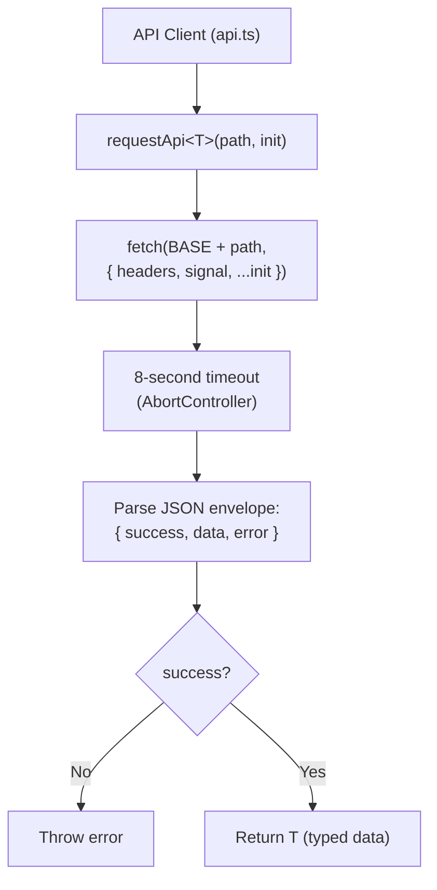
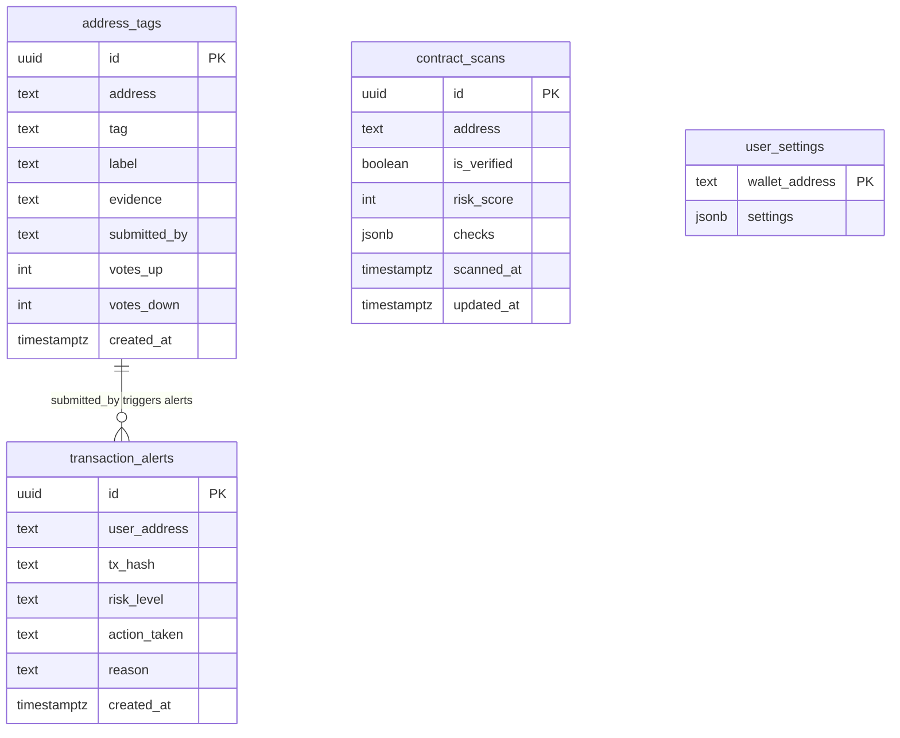

## 1. API Client

### 1.1 Request Architecture



### 1.2 Data Types

| Type | Interface | Fields |
|------|-----------|--------|
| Address Check | `AddressCheckData` | address, name, status, riskScore, category, tags, reportCount |
| Scan Input | `ScanInputData` | address, inputType, resolvedAddress, riskScore, riskLevel, isVerified |
| Address Tag | `AddressTagData` | id, address, tag, label, evidence, submittedBy, votesUp, votesDown |
| Contract Scan | `ContractScanData` | address, riskScore, level, checks[], source |
| Domain Check | `DomainCheckData` | domain, isScam, riskScore, category, reason |
| Platform Stats | `PlatformStatsData` | scamCount, checkCount |

---

## 2. Styling & UI Design System

### 2.1 Color Palette

| Name | Hex | Usage |
|------|-----|-------|
| `doman-bg` | `#000000` | Main background |
| `doman-card` | `#0d0d0d` | Card background |
| `doman-surface` | `#0a0a0a` | Input/surface background |
| `doman-hover` | `#161616` | Hover state |
| `doman-border` | `#1f1f1f` | Border |
| `doman-muted` | `#9ca3af` | Muted text |
| `doman-secondary` | `#c5c7cc` | Secondary text |
| `doman-primary` | `#3b82f6` | Primary accent (blue) |
| `doman-primary-dark` | `#2563eb` | Primary dark variant |
| `doman-danger` | `#f87171` | Danger/error (red) |
| `doman-success` | `#4ade80` | Success/safe (green) |
| `doman-warning` | `#facc15` | Warning (amber) |

### 2.2 Typography

| Usage | Font | Fallback |
|-------|------|----------|
| Body | Space Grotesk | system-ui, sans-serif |
| Code/Mono | Geist Mono | SF Mono, Consolas, monospace |

### 2.3 Custom Utilities

```css
.doman-header-gradient   /* Dark gradient for header */
.doman-gradient           /* Primary blue gradient for buttons */
.doman-glow-blue          /* Blue glow shadow */
.doman-glow-blue-hover    /* Stronger blue glow on hover */
.doman-spinner            /* Loading spinner */
```

### 2.4 Custom Animations

```css
animate-pulse-glow  /* Green pulse for connected indicator */
doman-slide-down     /* Slide down for warning banners */
```

### 2.5 UI Dimensions

- Popup width: `360px` fixed
- Popup min-height: `540px`
- Content overlay z-index: `2147483647` (max)
- Badge z-index: `2147483646`

---

## 3. Backend API Contract

The backend API base URL is configured via `PLASMO_PUBLIC_DOMAN_API_BASE`.

### Endpoints

#### Scan Input
```
GET /api/v1/scan/{input}?checker={optional}
Response: { success, data: ScanInputData }
```

#### Check Address
```
GET /api/v1/address/{address}
Response: { success, data: AddressCheckData }
```

#### Check Domain
```
GET /api/v1/check-domain?domain={domain}
Response: { success, data: DomainCheckData }
```

#### Get Address Tags
```
GET /api/v1/address/{address}
Response: { success, data: AddressCheckData (includes tags[]) }
```

#### Submit Address Tag
```
POST /api/v1/address-tags
Body: { address, tag, label?, evidence?, submittedBy? }
Response: { success, data: AddressTagData }
```

#### Vote on Tag
```
POST /api/v1/address-tags/vote
Body: { address, tagId?, tag, vote: "up"|"down" }
Response: { success, data: { success: boolean } }
```

#### Scan Contract
```
GET /api/v1/contracts/{address}/scan
Response: { success, data: ContractScanData }
```

#### Platform Stats
```
GET /api/v1/stats
Response: { success, data: { scamCount, scansToday?, totalReports? } }
```

### Envelope Format

All responses use the format:
```json
{
  "success": true,
  "data": { ... },
  "error": { "code": "...", "message": "..." }
}
```

---

## 4. Database Schema

> **Note:** This schema is designed for Supabase (PostgreSQL). The extension does not integrate directly — communication is through the backend API.



**SQL Definition:**

```sql
-- Address Tags
CREATE TABLE address_tags (
  id UUID DEFAULT gen_random_uuid() PRIMARY KEY,
  address TEXT NOT NULL,
  tag TEXT NOT NULL CHECK (tag IN ('scammer', 'suspicious', 'verified', 'bot', 'personal')),
  label TEXT,                    -- custom label (e.g., "Uniswap V3 Router")
  evidence TEXT,                 -- link/proof
  submitted_by TEXT NOT NULL,    -- wallet address submitter
  votes_up INT DEFAULT 0,
  votes_down INT DEFAULT 0,
  created_at TIMESTAMPTZ DEFAULT NOW(),
  UNIQUE(address, tag, submitted_by)
);

-- Contract Scans (cache)
CREATE TABLE contract_scans (
  id UUID DEFAULT gen_random_uuid() PRIMARY KEY,
  address TEXT NOT NULL UNIQUE,
  is_verified BOOLEAN,
  risk_score INT DEFAULT 0,
  checks JSONB DEFAULT '{}',
  scanned_at TIMESTAMPTZ DEFAULT NOW(),
  updated_at TIMESTAMPTZ DEFAULT NOW()
);

-- User Settings
CREATE TABLE user_settings (
  wallet_address TEXT PRIMARY KEY,
  settings JSONB DEFAULT '{}'
);

-- Transaction Alerts (history)
CREATE TABLE transaction_alerts (
  id UUID DEFAULT gen_random_uuid() PRIMARY KEY,
  user_address TEXT NOT NULL,
  tx_hash TEXT,
  risk_level TEXT CHECK (risk_level IN ('safe', 'warning', 'danger')),
  action_taken TEXT CHECK (action_taken IN ('allowed', 'blocked')),
  reason TEXT,
  created_at TIMESTAMPTZ DEFAULT NOW()
);
```

---

## 5. Testing & Debug

### 5.1 Manual Testing Checklist

#### Wallet Connection
- [ ] Click "Connect Wallet" -> MetaMask popup appears
- [ ] Approve connection -> address displayed in popup
- [ ] Close popup, reopen -> wallet still connected
- [ ] Disconnect -> state reset

#### Network Switch
- [ ] Connect wallet on Ethereum mainnet -> "Wrong Network" badge
- [ ] Click "Switch to Base Network" -> MetaMask prompts switch
- [ ] After switch -> "Base" badge (blue)

#### dApp Safety Check
- [ ] Visit `https://app.uniswap.org` -> badge "ON" (green), no banner
- [ ] Visit known scam domain -> banner "Phishing / Scam Site Detected!" (red)
- [ ] Visit non-dApp site (Google) -> no badge, no banner

#### Address Check
- [ ] Input valid address -> result card appears (trust score, risk, tags)
- [ ] Input ENS name -> resolved to address, result displayed
- [ ] Input invalid string -> error message

#### Address Tagging
- [ ] Submit tag "suspicious" + label + evidence -> "Tag submitted"
- [ ] Self-tagging rejected
- [ ] Invalid address rejected

#### Contract Scanner
- [ ] Trigger scan -> modal appears with loading state
- [ ] Result displayed: risk score, level, individual checks
- [ ] Close modal -> returns to popup

#### Settings
- [ ] Toggle Transaction Protection -> status changes
- [ ] Toggle Inline Warnings -> banner does not appear if disabled
- [ ] Toggle Active Tag -> badge does not appear if disabled
- [ ] Adjust Risk Threshold -> slider works
- [ ] Save Settings -> persisted across popup open/close

### 5.2 Chrome DevTools Debug

**Background Service Worker:**
1. `chrome://extensions` -> click "Service Worker" link on the extension card
2. DevTools opens for the background script
3. `console.log` messages visible in the Console tab

**Popup:**
1. Right-click extension icon -> "Inspect popup"
2. DevTools opens for the popup

**Content Scripts:**
1. On the target page -> F12 -> Console
2. Content script logs: `DOMAN wallet bridge loaded`, `DOMAN: dApp detected on ...`

### 5.3 Common Issues

| Issue | Cause | Solution |
|-------|-------|----------|
| "Install MetaMask first" | `window.ethereum` undefined | Install MetaMask extension |
| "Cannot connect wallet on this page" | Tab is `chrome://` or internal page | Navigate to a website first |
| Wallet not persisted | Service worker restart | State saved in `chrome.storage.local` — survives restarts |
| Safety check timeout | GoPlus API slow/unreachable | Falls back to local lists |
| Badge not updating | Service worker inactive | Wake up via user interaction |

---

## 6. Roadmap

### MVP (Current Status)

| Feature | Status |
|---------|--------|
| Wallet connection (MetaMask) | Done |
| Auto-switch to Base network | Done |
| dApp safety checking (GoPlus + local) | Done |
| Address check & risk analysis | Done |
| Address tagging UI | Done |
| Contract scanner UI | Done |
| Settings page | Done |
| Popup UI (complete) | Done |
| Content script badge overlay | Done |
| Content script warning banners | Done |

### Next Phase

| Feature | Priority | Est. |
|---------|----------|------|
| Supabase integration | HIGH | 1 day |
| Transaction interception + analysis | HIGH | 3 days |
| Contract scanner (full implementation) | MEDIUM | 2 days |
| Vote system for tags | MEDIUM | 1 day |
| Transaction history/alerts | LOW | 2 days |
| Onboarding flow | LOW | 1 day |
| Firefox support | LOW | 2 days |

### Out of Scope

- Multi-chain support (Base only)
- Mobile support
- AI-based scam detection
- Token price tracking

---

*This documentation is a living document. Updated as the project evolves.*
