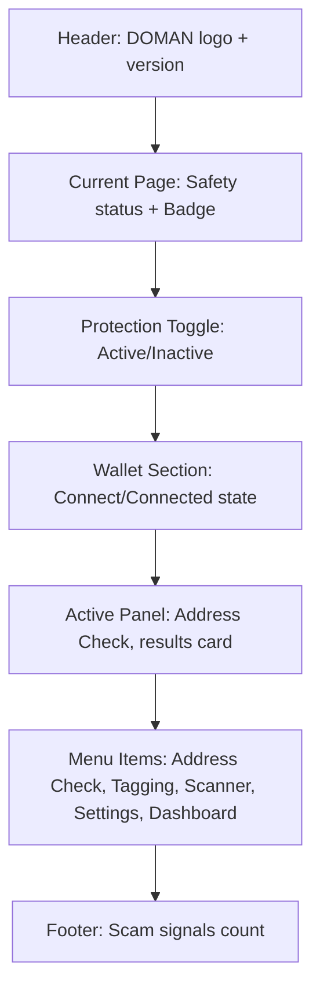
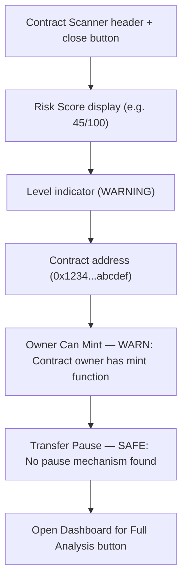
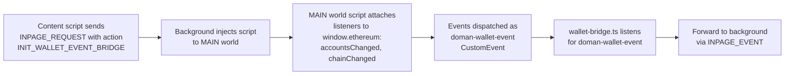
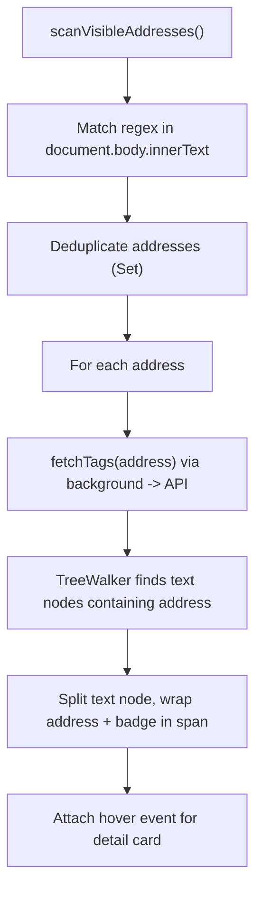

## 1. Extension Components

### 1.1 Background Service Worker

**File:** [src/background.ts](src/background.ts)

**Role:** Central message hub and wallet state manager. All critical operations run here.

#### Core Responsibilities

1. **Wallet Operations** — Connect, disconnect, switch chain via `chrome.scripting.executeScript` in MAIN world
2. **dApp Safety Checking** — Hybrid check (local lists -> DOMAN API -> GoPlus) with 10-minute cache
3. **Address Operations** — Check address risk, get tags, submit tags, vote tags
4. **Contract Scanning** — Proxy to backend API
5. **Page Status** — Combined domain check + safety level per tab
6. **Badge Management** — Set extension icon badge per tab (ON/WARN/RISK)
7. **Stats** — Platform-wide scam/check counters

#### Message Handler (`chrome.runtime.onMessage`)

The background receives and responds to the following messages:

| Message Type         | Parameter         | Return                          | Async |
| -------------------- | ----------------- | ------------------------------- | ----- |
| `CONNECT_WALLET`     | —                 | `WalletState`                   | Yes   |
| `DISCONNECT_WALLET`  | —                 | `{ success }`                   | No    |
| `GET_WALLET_STATE`   | —                 | `WalletState`                   | No    |
| `SWITCH_CHAIN`       | —                 | `WalletState`                   | Yes   |
| `CHECK_DAPP`         | `url`             | `{ level, reason? }`            | Yes   |
| `DAPP_RESULT`        | `level, hostname` | `{ success }`                   | No    |
| `CHECK_ADDRESS`      | `address`         | `{ success, data }`             | Yes   |
| `GET_ADDRESS_TAGS`   | `address`         | `{ success, data }`             | Yes   |
| `SUBMIT_ADDRESS_TAG` | `payload`         | `{ success, data }`             | Yes   |
| `VOTE_ADDRESS_TAG`   | `payload`         | `{ success, data }`             | Yes   |
| `SCAN_CONTRACT`      | `address`         | `{ success, data }`             | Yes   |
| `CHECK_DOMAIN`       | `domain`          | `{ success, data }`             | Yes   |
| `GET_PAGE_STATUS`    | `url`             | `{ success, safetyLevel, ... }` | Yes   |
| `GET_STATS`          | —                 | `{ success, data }`             | Yes   |
| `OPEN_DASHBOARD`     | —                 | `{ success, url }`              | Yes   |
| `CLEAR_CACHE`        | —                 | `{ success }`                   | No    |
| `INPAGE_REQUEST`     | `action`          | `{ success }`                   | Yes   |
| `INPAGE_EVENT`       | `event, data`     | —                               | No    |

#### Wallet State Management

```typescript
interface WalletState {
  address: string | null; // "0x..." connected wallet address
  chainId: number | null; // 8453 = Base
  connected: boolean; // true if wallet connected
}
```

State is stored in `chrome.storage.local` and synced to the popup via `chrome.storage.onChanged`. This ensures the wallet remains connected even when the popup is closed.

#### MAIN World Script Injection

```typescript
async function executeInMainWorld<T>(tabId: number, func: () => T): Promise<T> {
  const results = await chrome.scripting.executeScript({
    target: { tabId },
    world: "MAIN",
    func,
  });
  return results[0].result as T;
}
```

This pattern is used to:

- Check if `window.ethereum` exists
- Request accounts (`eth_requestAccounts`)
- Get chain ID
- Switch/add chain (`wallet_switchEthereumChain`, `wallet_addEthereumChain`)
- Attach wallet event listeners (accountsChanged, chainChanged)

#### dApp Safety Cache

```typescript
const safetyCache = new Map<
  string,
  { level: SafetyLevel; timestamp: number }
>();
const CACHE_TTL = 10 * 60 * 1000; // 10 minutes
```

Check results are cached per hostname for 10 minutes to reduce API calls.

#### Badge Management

The extension icon badge changes based on the tab's safety level:

| Level     | Badge Text | Badge Color       |
| --------- | ---------- | ----------------- |
| `safe`    | `ON`       | `#22c55e` (green) |
| `warning` | `WARN`     | `#f59e0b` (amber) |
| `danger`  | `RISK`     | `#ef4444` (red)   |
| `unknown` | (empty)    | —                 |

---

### 1.2 Popup UI

**File:** [src/popup.tsx](src/popup.tsx)

**Role:** Main extension UI displayed when the user clicks the extension icon.

#### Layout



**Panel Layout Details:**

| Section      | Content                                                                                         |
| ------------ | ----------------------------------------------------------------------------------------------- |
| Header       | DOMAN logo + version                                                                            |
| Page Status  | Current page safety status + badge indicator                                                    |
| Protection   | Toggle protection on/off                                                                        |
| Wallet       | Connect wallet button (or connected state display)                                              |
| Active Panel | Address input + check button + result card (Trust Score, Status, Risk Score, Category, Reports) |
| Menu Items   | Address Check, Address Tagging, Contract Scanner, Settings, Open Dashboard                      |
| Footer       | Scam signals count + powered by                                                                 |

#### State Management

The popup uses React `useState` + `useEffect` without an external state library:

| State               | Type                         | Description                |
| ------------------- | ---------------------------- | -------------------------- |
| `wallet`            | `WalletState`                | Connected wallet info      |
| `status`            | `ConnectionStatus`           | Wallet connection status   |
| `pageSafety`        | `PageSafety`                 | Current page safety level  |
| `protectionEnabled` | `boolean`                    | Toggle protection on/off   |
| `addressResult`     | `AddressResult \| null`      | Address check result       |
| `addressTags`       | `AddressTag[]`               | Tags for looked-up address |
| `scannerResult`     | `ContractScanResult \| null` | Contract scan result       |
| `stats`             | `{ scamCount, checkCount }`  | Platform stats             |
| `activePanel`       | `MenuPanel`                  | Which panel is shown       |

#### Panel System

The popup uses panel switching:

- **Address Check** — Default panel. Input address/ENS/domain, check risk, view tags
- **Address Tagging** — Submit community tags (scammer, suspicious, verified, bot, personal)

#### Contract Scanner Modal

The scanner is displayed as an overlay modal on top of the popup:



#### Key User Actions

| Action            | Function             | Flow                                                                          |
| ----------------- | -------------------- | ----------------------------------------------------------------------------- |
| Connect Wallet    | `connectWallet()`    | Popup -> Background `CONNECT_WALLET` -> MAIN world `eth_requestAccounts`      |
| Disconnect        | `disconnect()`       | Popup -> Background `DISCONNECT_WALLET` -> Reset state                        |
| Switch Network    | `switchToBase()`     | Popup -> Background `SWITCH_CHAIN` -> MAIN world `wallet_switchEthereumChain` |
| Check Address     | `checkAddress()`     | Popup -> Background `CHECK_ADDRESS` -> API `scanInput` + `checkAddress`       |
| Submit Tag        | `submitAddressTag()` | Popup -> Background `SUBMIT_ADDRESS_TAG` -> API `address-tags`                |
| Scan Contract     | `runContractScan()`  | Popup -> Background `SCAN_CONTRACT` -> API `contracts/scan`                   |
| Toggle Protection | `toggleProtection()` | Write `domanProtectionEnabled` to chrome.storage                              |

---

### 1.3 Options / Settings Page

**File:** [src/options.tsx](src/options.tsx)

**Role:** Full-tab settings page opened via `chrome.runtime.openOptionsPage()`.

#### Stored Settings

| Key                      | Type      | Default | Description                            |
| ------------------------ | --------- | ------- | -------------------------------------- |
| `domanProtectionEnabled` | `boolean` | `true`  | Transaction protection toggle          |
| `domanShowWarnings`      | `boolean` | `true`  | Show inline warning banners            |
| `domanShowActiveTag`     | `boolean` | `true`  | Show "DOMAN Active" badge on dApps     |
| `domanRiskThreshold`     | `number`  | `65`    | Min score for elevated warning (30-95) |

Settings are saved to `chrome.storage.local` and read by content scripts in real-time via `chrome.storage.onChanged`.

---

### 1.4 Content Scripts

#### 1.4.1 Wallet Bridge (`wallet-bridge.ts`)

**File:** [src/contents/wallet-bridge.ts](src/contents/wallet-bridge.ts)
**Run at:** `document_start` | **World:** ISOLATED

**Purpose:** Bridge wallet events from MAIN world to the background service worker.

**Flow:**



**Why this pattern?**

- Content scripts run in ISOLATED world, cannot access `window.ethereum` directly
- MAIN world script can access `window.ethereum` but cannot call `chrome.runtime.sendMessage`
- CustomEvent bridge connects the two

**Wallet event listener uses a retry mechanism:**

```
Attach listeners -> if failed -> retry every 100ms (max 50 attempts = 5 seconds)
```

---

#### 1.4.2 dApp Safety Checker (`dapp-checker.tsx`)

**File:** [src/contents/dapp-checker.tsx](src/contents/dapp-checker.tsx)
**Run at:** `document_idle` | **World:** ISOLATED

**Purpose:** Auto-check every visited page, display a warning banner if dangerous.

**Flow:**

1. At `document_idle`, run `detectDApp()` to check if the page is a dApp
2. If a dApp is detected, send `CHECK_DAPP` to background
3. Background checks local lists -> DOMAN API (`/api/v1/check-domain`) -> GoPlus
4. If the result is `danger` or `warning`, display a banner overlay
5. Every visited dApp is tracked once per session to enrich the DOMAN database

**Banner UI:**

- **Danger (red):** "Phishing / Scam Site Detected!" — with full description
- **Warning (amber):** "Proceed with Caution" — caution warning
- Banner is dismissible, position: `fixed bottom-4 right-4`, z-index: `2147483647`
- Slide-down animation on appearance

**Conditions for displaying the banner:**

```
isDApp === true && showWarnings === true && protectionEnabled === true
&& safetyLevel !== "safe" && safetyLevel !== "unknown" && !dismissed
```

---

#### 1.4.3 Address Overlay & Badge (`contents/index.tsx`)

**File:** [src/contents/index.tsx](src/contents/index.tsx)
**Run at:** `document_idle` | **World:** ISOLATED

**Purpose:** Display status badge + address tagging overlay on dApp pages.

**Features:**

1. **Status Badge** — Floating chip at `top-14 right-14`:
   - `DOMAN SAFE` (green), `DOMAN WARN` (yellow), `DOMAN RISK` (red), `DOMAN CHECK` (gray)
   - `DOMAN PAUSED` if protection is turned off
   - Hover opacity change for interactivity

2. **Address Tagging Overlay** — For each Ethereum address detected on the page:
   - Scan visible text using regex `0x[a-fA-F0-9]{40}`
   - Limit: 25 unique addresses per page
   - Skip elements: `<script>`, `<style>`, `<textarea>`, `<input>`
   - Display inline badge next to the address:
     - `SCAM` (red) — scammer tag
     - `WARN` (yellow) — suspicious tag
     - `VER` (green) — verified tag
     - `BOT` (purple) — bot tag
     - `TAG` (gray) — other tags
   - Hover shows detail card: address, tag type, vote counts
   - Uses `MutationObserver` to detect dynamic content changes

**Address Detection & Rendering Flow:**


