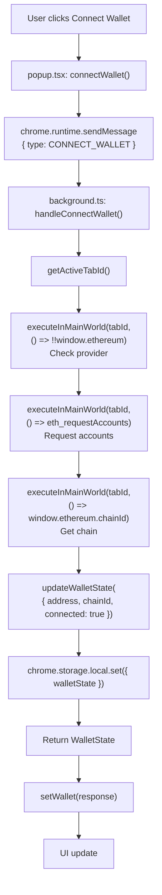
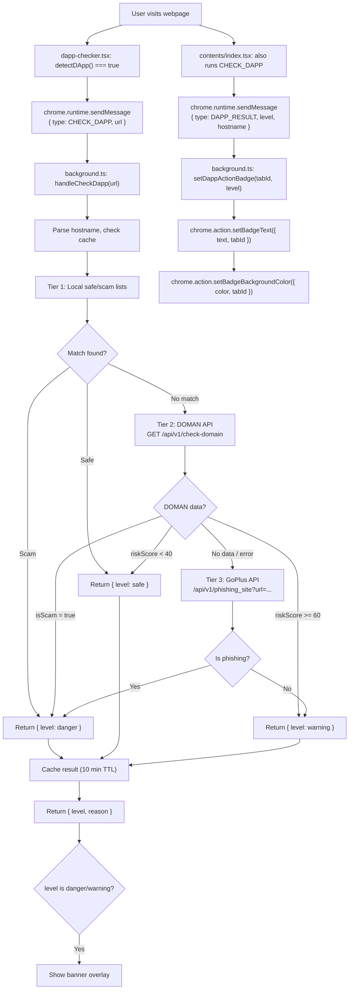
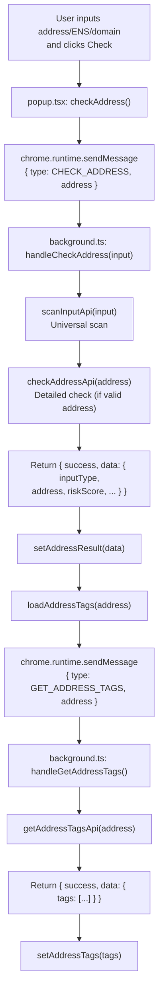
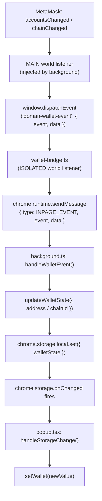
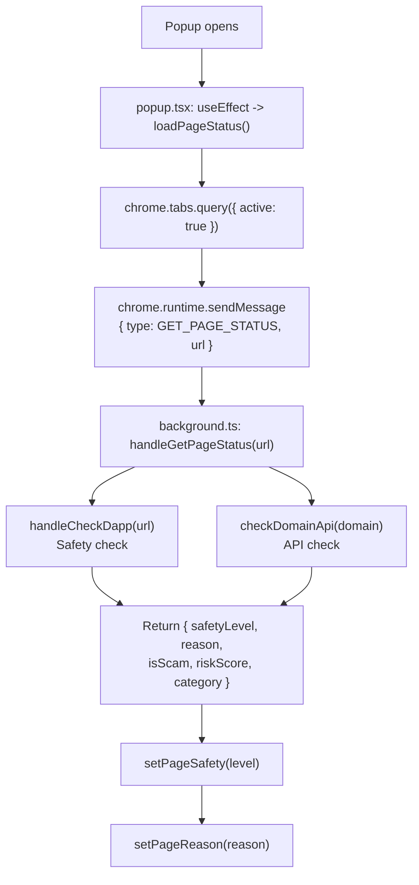

## 1. Data Flows & Messaging

### 1.1 Wallet Connection

```mermaid
flowchart TD
    A["User clicks Connect Wallet"] --> B["popup.tsx: connectWallet()"]
    B --> C["chrome.runtime.sendMessage<br/>{ type: CONNECT_WALLET }"]
    C --> D["background.ts: handleConnectWallet()"]
    D --> E["getActiveTabId()"]
    E --> F["executeInMainWorld(tabId,<br/>() => !!window.ethereum)<br/>Check provider"]
    F --> G["executeInMainWorld(tabId,<br/>() => eth_requestAccounts)<br/>Request accounts"]
    G --> H["executeInMainWorld(tabId,<br/>() => window.ethereum.chainId)<br/>Get chain"]
    H --> I["updateWalletState(<br/>{ address, chainId, connected: true })"]
    I --> J["chrome.storage.local.set({ walletState })"]
    J --> K["Return WalletState"]
    K --> L["setWallet(response)"]
    L --> M["UI update"]
```

### 1.2 dApp Safety Check (Auto)

```mermaid
flowchart TD
    A["User visits webpage"] --> B["dapp-checker.tsx: detectDApp() === true"]
    B --> C["chrome.runtime.sendMessage<br/>{ type: CHECK_DAPP, url }"]
    C --> D["background.ts: handleCheckDapp(url)"]
    D --> E["Parse hostname, check cache"]
    E --> F["Tier 1: Local safe/scam lists"]
    F --> G{Match found?}
    G -->|Scam| H["Return { level: danger }"]
    G -->|Safe| I["Return { level: safe }"]
    G -->|No match| J["Tier 2: DOMAN API<br/>GET /api/v1/check-domain"]
    J --> K{DOMAN data?}
    K -->|isScam = true| H
    K -->|riskScore < 40| I
    K -->|riskScore >= 60| L["Return { level: warning }"]
    K -->|No data / error| M["Tier 3: GoPlus API<br/>/api/v1/phishing_site?url=..."]
    M --> N{Is phishing?}
    N -->|Yes| H
    N -->|No| L
    H --> O["Cache result (10 min TTL)"]
    I --> O
    L --> O
    O --> P["Return { level, reason }"]
    P --> Q{level is danger/warning?}
    Q -->|Yes| R["Show banner overlay"]
    A --> S["contents/index.tsx: also runs CHECK_DAPP"]
    S --> T["chrome.runtime.sendMessage<br/>{ type: DAPP_RESULT, level, hostname }"]
    T --> U["background.ts: setDappActionBadge(tabId, level)"]
    U --> V["chrome.action.setBadgeText({ text, tabId })"]
    V --> W["chrome.action.setBadgeBackgroundColor({ color, tabId })"]
```

### 1.3 Address Check

```mermaid
flowchart TD
    A["User inputs address/ENS/domain<br/>and clicks Check"] --> B["popup.tsx: checkAddress()"]
    B --> C["chrome.runtime.sendMessage<br/>{ type: CHECK_ADDRESS, address }"]
    C --> D["background.ts: handleCheckAddress(input)"]
    D --> E["scanInputApi(input)<br/>Universal scan"]
    E --> F["checkAddressApi(address)<br/>Detailed check (if valid address)"]
    F --> G["Return { success, data: { inputType,<br/>address, riskScore, ... } }"]
    G --> H["setAddressResult(data)"]
    H --> I["loadAddressTags(address)"]
    I --> J["chrome.runtime.sendMessage<br/>{ type: GET_ADDRESS_TAGS, address }"]
    J --> K["background.ts: handleGetAddressTags()"]
    K --> L["getAddressTagsApi(address)"]
    L --> M["Return { success, data: { tags: [...] } }"]
    M --> N["setAddressTags(tags)"]
```

### 1.4 Wallet Events (Real-time)

```mermaid
flowchart TD
    A["MetaMask: accountsChanged / chainChanged"] --> B["MAIN world listener<br/>(injected by background)"]
    B --> C["window.dispatchEvent<br/>('doman-wallet-event', { event, data })"]
    C --> D["wallet-bridge.ts<br/>(ISOLATED world listener)"]
    D --> E["chrome.runtime.sendMessage<br/>{ type: INPAGE_EVENT, event, data }"]
    E --> F["background.ts: handleWalletEvent()"]
    F --> G["updateWalletState({ address / chainId })"]
    G --> H["chrome.storage.local.set({ walletState })"]
    H --> I["chrome.storage.onChanged fires"]
    I --> J["popup.tsx: handleStorageChange()"]
    J --> K["setWallet(newValue)"]
```

### 1.5 Page Status (On Popup Open)

```mermaid
flowchart TD
    A["Popup opens"] --> B["popup.tsx: useEffect -> loadPageStatus()"]
    B --> C["chrome.tabs.query({ active: true })"]
    C --> D["chrome.runtime.sendMessage<br/>{ type: GET_PAGE_STATUS, url }"]
    D --> E["background.ts: handleGetPageStatus(url)"]
    E --> F["handleCheckDapp(url)<br/>Safety check"]
    E --> G["checkDomainApi(domain)<br/>API check"]
    F --> H["Return { safetyLevel, reason,<br/>isScam, riskScore, category }"]
    G --> H
    H --> I["setPageSafety(level)"]
    I --> J["setPageReason(reason)"]
```
