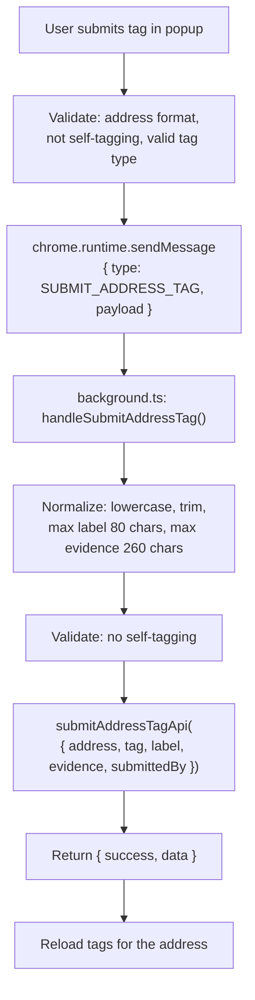
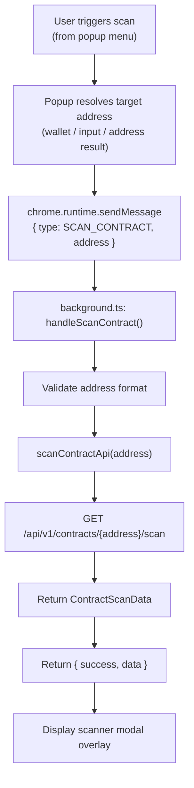

## 1. Address Tagging

### 1.1 Tag Types

| Tag | Label | Color | Description |
|-----|-------|-------|-------------|
| `scammer` | SCAM | Red | Proven scam wallet |
| `suspicious` | WARN | Yellow | Suspicious indicators |
| `verified` | VER | Green | Verified entity |
| `bot` | BOT | Purple | Automated wallet |
| `personal` | TAG | Gray | Personal user label |

### 1.2 Submission Flow



### 1.3 Voting System

Users can vote up/down on existing tags:
```
chrome.runtime.sendMessage({ type: VOTE_ADDRESS_TAG, payload: { address, tagId, tag, vote } })
```

### 1.4 Content Script Integration

Addresses found on dApp pages are automatically tagged:
- TreeWalker scans all text nodes
- Regex match `0x[a-fA-F0-9]{40}`
- Inline badge next to the address
- Hover shows detail card with votes

---

## 2. Contract Scanner

### 2.1 Scan Flow



### 2.2 Scan Result Format

```typescript
interface ContractScanData {
  address: string
  riskScore: number                    // 0-100
  level: "safe" | "warning" | "danger" | "unknown"
  checks: ContractScanCheckItem[]      // Individual check results
  source: "api" | "local"
}

interface ContractScanCheckItem {
  key: string                          // e.g. "owner_can_mint"
  label: string                        // e.g. "Owner Can Mint"
  status: "safe" | "warning" | "danger" | "unknown"
  reason: string                       // e.g. "Contract owner has mint function"
}
```
