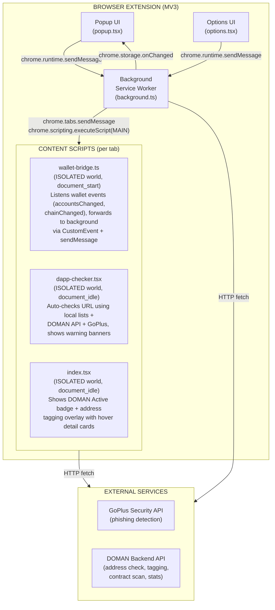

# DOMAN — End-to-End Documentation

> **Browser Extension: Community-Powered Security Layer for Base Chain**
> Version 0.2.0 | Last Updated: 28 April 2026

---

## 1. Introduction

### 1.1 What is DOMAN?

DOMAN is a browser extension that provides a **community-powered security layer** for the Base chain ecosystem. The extension protects users from:

- **Phishing sites** — automatic detection when users visit dangerous sites
- **Scam addresses** — community database that flags suspicious wallets
- **Risky contracts** — scanner that analyzes smart contracts before interaction
- **Wallet-draining bots** — bots that auto-approve transactions and drain balances

### 1.2 Problem Solved

User wallets on Base chain can be **auto-drained by bots** — malicious bots that auto-approve transactions. Whenever funds exceeding $1 enter, they are immediately transferred to the attacker's wallet. There is no security layer that warns users before dangerous transactions are executed.

### 1.3 Target Users

- Base chain users (DeFi users, traders, airdrop hunters)
- Web3 communities active on Base
- dApp developers on Base

---

## 2. System Architecture



### Execution Worlds

The extension uses two execution worlds in content scripts:

| World      | Access                             | Used by                                                    |
| ---------- | ---------------------------------- | ---------------------------------------------------------- |
| `ISOLATED` | Chrome API, DOM, `chrome.runtime`  | All content scripts                                        |
| `MAIN`     | `window.ethereum`, page JS context | Wallet connect/switch via `chrome.scripting.executeScript` |

**Important:** Plasmo v0.90.5 does not reliably register `.ts` MAIN world content scripts in the manifest. Therefore, MAIN world code is injected via `chrome.scripting.executeScript({ world: "MAIN" })` from the background script. This is the same pattern used by MetaMask.

---

## 3. Tech Stack

| Component      | Technology                | Version      |
| -------------- | ------------------------- | ------------ |
| Framework      | Plasmo                    | 0.90.5       |
| UI Library     | React                     | 18.2.0       |
| Language       | TypeScript                | 5.3.3        |
| Styling        | Tailwind CSS              | 3.4.19       |
| Chain          | Base (Chain ID: 8453)     | -            |
| Ethereum SDK   | ethers.js                 | 6.16.0       |
| Wallet Support | MetaMask, Coinbase Wallet | -            |
| Security API   | GoPlus Labs               | v1           |
| Backend API    | REST (custom)             | v1           |
| Build Tool     | Plasmo (webpack-based)    | -            |
| CSS Utilities  | clsx, tailwind-merge      | 2.1.1, 3.5.0 |
| Fonts          | Space Grotesk, Geist Mono | -            |

---

## 4. Project Structure

```
doman-extension/
├── package.json                          # Dependencies, scripts, manifest config
├── tailwind.config.js                    # Tailwind theme, colors, animations
├── tsconfig.json                         # TypeScript configuration
├── postcss.config.js                     # PostCSS + Tailwind + Autoprefixer
├── README.md                             # Quick start guide
│
├── docs/
│   ├── PRD.md                            # Product Requirements Document
│   └── DOCUMENTATION.md                  # This file
│
├── walkthrough.md                        # Implementation walkthrough
│
├── src/
│   ├── constants/
│   │   └── index.ts                      # Message types, chain config, safety lists, types
│   │
│   ├── background/
│   │   └── index.ts                      # Background service entry point
│   ├── background.ts                     # Background service worker logic
│   │
│   ├── popup/
│   │   └── index.tsx                     # Popup entry point
│   ├── popup.tsx                         # Popup UI component (main UI)
│   │
│   ├── options.tsx                       # Options/Settings page (full tab)
│   │
│   ├── content/
│   │   └── index.tsx                     # Content script badge entry
│   │
│   ├── contents/
│   │   ├── index.tsx                     # Address overlay + badge content script
│   │   ├── wallet-bridge.ts             # Wallet event bridge content script
│   │   └── dapp-checker.tsx             # Auto safety checker content script
│   │
│   ├── utils/
│   │   ├── api.ts                        # Backend API client
│   │   ├── detect-dapp.ts               # dApp detection heuristics
│   │   └── cn.ts                         # clsx + tailwind-merge utility
│   │
│   ├── types/
│   │   ├── ethereum.d.ts                # Window.ethereum type definitions
│   │   └── style.d.ts                   # CSS module type declarations
│   │
│   ├── styles/
│   │   └── globals.css                  # CSS custom properties
│   │
│   ├── style.css                         # Main styles (Tailwind + custom utilities)
│   │
│   └── assets/
│       ├── icon.png                      # Extension icon
│       └── logo.png                      # Brand logo
│
└── build/                                # Build output (generated)
    └── chrome-mv3-prod/                  # Production build
```

---

## 5. Installation & Build

### 5.1 Prerequisites

- Node.js >= 18
- npm >= 9
- Chrome / Chromium browser
- MetaMask or Coinbase Wallet

### 5.2 Install & Run

```bash
# Clone repository
git clone https://github.com/domanprotocol/extension.git
cd wallo-extension

# Install dependencies
npm install

# Development mode (hot-reload)
npm run dev

# Production build
npm run build

# Package for Chrome Web Store (ZIP)
npm run package
```

### 5.3 Load Extension in Chrome

1. Run `npm run build`
2. Open Chrome -> `chrome://extensions/`
3. Enable **Developer mode** (toggle in top right)
4. Click **Load unpacked**
5. Select the `build/chrome-mv3-prod/` folder
6. The extension icon appears in the toolbar

### 5.4 Manual Install from Release

1. Download latest `doman-extension-v0.1.0.zip` from [Releases](/domanprotocol/extension/releases)
2. Extract the ZIP file
3. Open `chrome://extensions/`
4. Enable **Developer mode**
5. Click **Load unpacked** -> select the extracted folder

### 5.5 Environment Variables

| Variable                       | Default                            | Description                      |
| ------------------------------ | ---------------------------------- | -------------------------------- |
| `PLASMO_PUBLIC_DOMAN_API_BASE` | `https://domanprotocol.vercel.app` | Base URL for DOMAN backend API   |
| `PLASMO_PUBLIC_DASHBOARD_URL`  | `https://domanprotocol.vercel.app` | Dashboard URL for deep analytics |

---

## 6. Manifest & Permissions

The extension uses **Manifest V3** generated by Plasmo.

### Permissions

| Permission   | Reason                                      |
| ------------ | ------------------------------------------- |
| `storage`    | Persist wallet state, user settings, cache  |
| `activeTab`  | Access active tab for wallet operations     |
| `scripting`  | Inject MAIN world script for wallet connect |
| `tabs`       | Query tab info for page status check        |
| `<all_urls>` | Content scripts run on all pages            |

### Content Scripts Registration (by Plasmo)

| Script                  | `run_at`         | World    | Matches      |
| ----------------------- | ---------------- | -------- | ------------ |
| `wallet-bridge.ts`      | `document_start` | ISOLATED | `<all_urls>` |
| `dapp-checker.tsx`      | `document_idle`  | ISOLATED | `<all_urls>` |
| `index.tsx` (contents/) | `document_idle`  | ISOLATED | `<all_urls>` |
