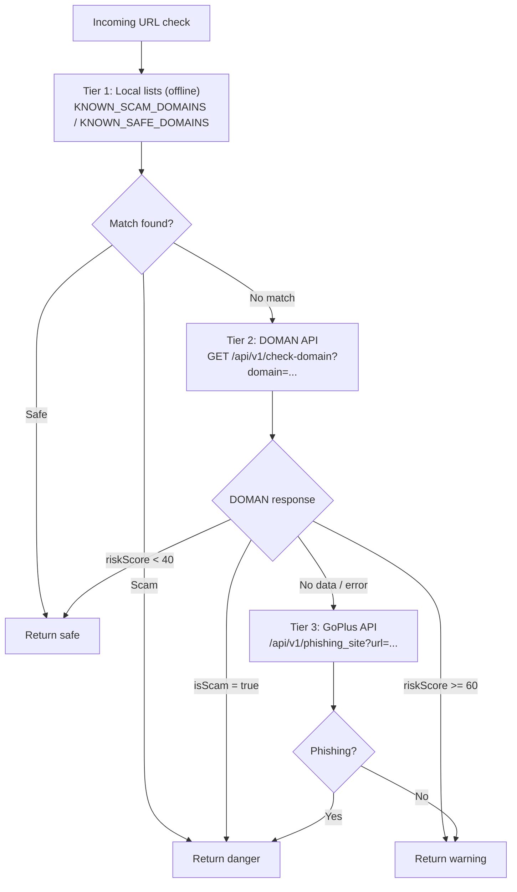

## 1. dApp Security System

### 1.1 Hybrid Safety Check

The system uses a 3-tier approach:

### 1.2 Safety Level Semantics

| Level     | Color        | Meaning                                            | Badge  | Banner                  |
| --------- | ------------ | -------------------------------------------------- | ------ | ----------------------- |
| `safe`    | Green        | Domain verified, not phishing                      | `ON`   | Not displayed           |
| `warning` | Yellow/Amber | Not detected as phishing, but not in verified list | `WARN` | Displayed (dismissible) |
| `danger`  | Red          | Detected as phishing/scam site                     | `RISK` | Displayed (dismissible) |
| `unknown` | Gray         | Not a dApp or cannot be checked                    | —      | Not displayed           |

### 1.3 Caching

- Cache key: normalized hostname (without `www.`)
- TTL: 10 minutes
- Stored in memory (`Map`) in the service worker
- Can be cleared via `CLEAR_CACHE` message
