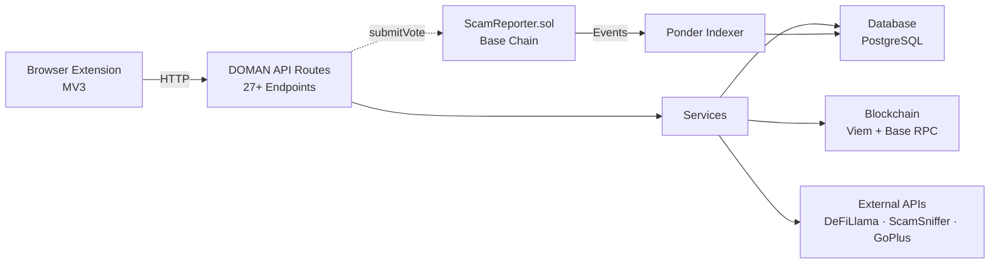

# DOMAN Documentation

**Community-Powered Security & Decision Engine for Base Chain**

DOMAN is an open-source Web3 security platform that protects users on Base chain from phishing sites, scam addresses, and risky smart contracts through community-driven reporting and automated detection.

---

## Products

### Smart Contracts

On-chain scam reporting and community voting contracts deployed on Base chain.

- ScamReporter contract with anti-double-vote enforcement
- Target-scoped voting (address, ENS, domain)
- Gas-efficient hash-based design with `keccak256` off-chain verification
- Indexer-friendly events for Ponder integration

[Overview →](/smart-contracts/) · [ScamReporter →](/smart-contracts/scam-reporter) · [Development →](/smart-contracts/development)

### Dashboard (Frontend + API)

Interactive web dashboard for address scanning, contract analysis, community reporting, and platform management.

- Address / ENS / Domain checker with Trust Score (0-100)
- Contract bytecode scanner with 17+ scam pattern detection
- Community scam reporting with on-chain verification
- Watchlist, tags, reputation system, dApps directory
- REST API backend (27+ endpoints)

[Overview →](/dashboard/) · [API Routes →](/dashboard/api-routes) · [API Reference →](https://domanprotocol.vercel.app/api-reference)

### Browser Extension

Chrome extension providing real-time protection while browsing dApps on Base chain.

- Auto phishing detection via GoPlus + local blacklist
- Address risk checking inline on any page
- Contract scanner with risk analysis
- Wallet connection with auto Base network switch
- Community address tagging

[Overview →](/extension/) · [Design Guide →](/extension/EXTENSION_DESIGN_GUIDE)

---

## Architecture Overview

## Quick Links

| Resource | Description |
|----------|-------------|
| [Smart Contracts](/smart-contracts/) | ScamReporter contract, ABI, deployment |
| [Dashboard Docs](/dashboard/) | Frontend + API + Database full documentation |
| [API Reference](https://domanprotocol.vercel.app/api-reference) | Interactive API docs with request/response schemas |
| [Extension Docs](/extension/) | Browser extension architecture and features |
| [Design Guide](/extension/EXTENSION_DESIGN_GUIDE) | Color system, typography, components |

## Tech Stack

| Layer | Technology |
|-------|------------|
| Frontend | Next.js 16, React 19, Tailwind CSS 4 |
| Extension | Plasmo, React 18, ethers.js 6 |
| Smart Contracts | Solidity ^0.8.13, Foundry |
| Blockchain | Viem, Wagmi v3, Base Chain |
| Database | PostgreSQL (Supabase), Prisma 7 |
| Language | TypeScript 5.x |
