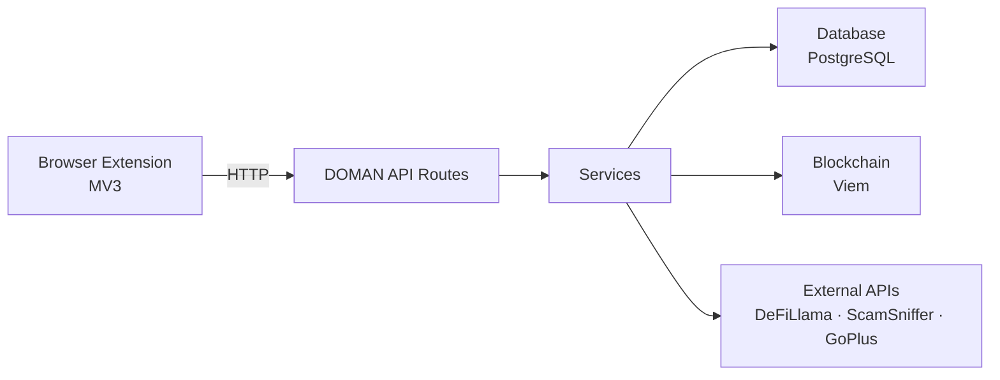

# DOMAN Documentation

**Community-Powered Security & Decision Engine for Base Chain**

DOMAN is a Web3 security platform that protects users on Base chain from phishing sites, scam addresses, and risky smart contracts through community-driven reporting and automated detection.

---

## Products

### Dashboard (Frontend + API)

Interactive web dashboard for address scanning, contract analysis, community reporting, and platform management.

- Address Checker with risk scoring
- Contract bytecode scanner with pattern detection
- Community scam reporting with on-chain verification
- Watchlist and tag management
- REST API backend (22+ endpoints)

[Dashboard Overview →](/dashboard/)

### Browser Extension

Chrome extension providing real-time protection while browsing dApps on Base chain.

- Auto phishing detection via GoPlus + local blacklist
- Address risk checking inline on any page
- Contract scanner with risk analysis
- Wallet connection with auto Base network switch
- Community address tagging

[Extension Overview →](/extension/) · [Design Guide →](/extension/EXTENSION_DESIGN_GUIDE)

---

## Architecture Overview

## Quick Links

| Resource | Description |
|----------|-------------|
| [Dashboard Docs](/dashboard/) | Frontend + API + Database full documentation |
| [Extension Docs](/extension/) | Browser extension architecture and features |
| [Design Guide](/extension/EXTENSION_DESIGN_GUIDE) | Color system, typography, components |

## Tech Stack

| Layer | Technology |
|-------|------------|
| Frontend | Next.js 16, React 19, Tailwind CSS 4 |
| Extension | Plasmo, React 18, ethers.js 6 |
| Blockchain | Viem, Wagmi v3, Base Chain |
| Database | PostgreSQL (Supabase), Prisma 7 |
| Language | TypeScript 5.x |
